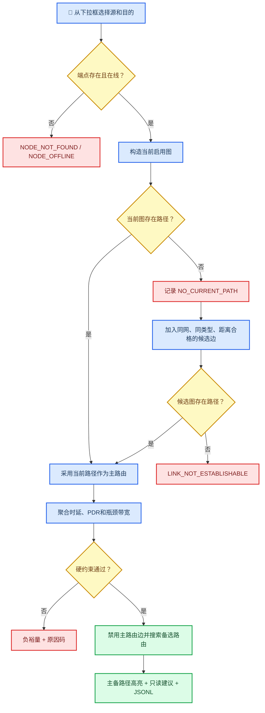

# 任务可达性评估

_功能版本 0.6.0 · 当前图、候选图与主备路由 · 最后验证：2026-07-30_

---

## 📋 功能边界

本版本使用同一份不可变资源快照，分别构造“当前启用图”和“参数化候选图”。评估结果
只输出结论、裕量、主备路由和建议，不调用链路启停、改频或改路由接口。

- `reachable`：当前启用图中已经存在允许的路径。
- `can_establish`：当前路径存在，或候选图中存在满足参数化门限的路径。
- `can_complete`：选定主路径满足用户输入的时延、PDR和带宽硬约束。
- `stable`：当前路径满足约束且PDR不低于80%。候选路径因尚未真实建链，不直接判为稳定。

## 🧭 评估流程



## 🗺️ 当前图与候选图

图节点是通信端点，任务输入使用平台名称。同一平台有多个在线端点时，算法将它们作为
多源或多目的节点。

当前边必须满足：

- AFSIM链路和两端通信端点均为`ONLINE`
- 网络类型不是`UNKNOWN`
- 网络类型符合任务允许网络

候选边还必须满足：

- 两端属于同一个`network_name`
- 两端网络类型相同且均在线
- 两端不是同一平台
- 三维距离不超过对应网络的演示门限
- 当前图中不存在同方向的已启用边

当前候选模型默认值如下。这些数值仅用于资源管理器功能演示，不代表真实装备性能，后续
将迁移到版本化配置文件，并可由甲方模块输入覆盖。

| 网络 | 最大候选距离 | 建链附加时延 | 先验PDR | 先验带宽 |
| --- | ---: | ---: | ---: | ---: |
| Link-11 | 300 km | 80 ms | 90% | 2.4 kbit/s |
| Link-16 | 500 km | 20 ms | 95% | 238 kbit/s |
| 卫通 | 45,000 km | 40 ms | 92% | 5 Mbit/s |
| CDL | 250 km | 10 ms | 96% | 45 Mbit/s |

候选边的预测指标和由其计算的裕量统一标记为
`origin=PARAMETERIZED_MODEL`、`confidence=LOW`，不会伪装成AFSIM实测数据。

## 🧮 路径算法与指标

当前主路由优先于候选路径。路径搜索使用确定性的Dijkstra算法，当前边权重为逐跳预测
时延；候选边额外增加固定惩罚，使算法优先复用现有链路。当前图不可达时才允许候选边
成为主路径。

找到主路由后，算法临时禁用主路由的所有有向边，再搜索一条边不重合备选路径。当前
版本最多返回一条备选路径；它可能完全由当前边组成，也可能包含需要先建链的候选边。

当前边优先采用链路10秒窗口的实测平均传输时延；没有时延样本时使用三维距离传播时延。
路径PDR为逐跳PDR乘积，路径带宽为所有跳有效数据率的最小值。

## 📏 裕量定义

\[
Margin_{bandwidth}=Bandwidth_{bottleneck}-Bandwidth_{required}
\]

\[
Margin_{delay}=Delay_{allowed}-Delay_{predicted}
\]

\[
Margin_{reliability}=PDR_{estimated}-PDR_{required}
\]

正数表示满足且有余量，负数表示不足。必需数据无效时返回`DATA_INVALID`，不使用零值
冒充测量值。

## 🚨 原因码

| 原因码 | 触发条件 |
| --- | --- |
| `DATA_INVALID` | 必需的PDR或带宽数据无效 |
| `NODE_NOT_FOUND` | 平台名称不存在 |
| `NODE_OFFLINE` | 源或目的没有在线通信端点 |
| `NETWORK_TYPE_UNKNOWN` | 当前边没有明确网络类型 |
| `NO_CURRENT_PATH` | 当前启用图无允许路径；候选路径仍可能可建 |
| `LINK_NOT_ESTABLISHABLE` | 当前图和候选图均无满足门限的路径 |
| `BANDWIDTH_MARGIN_NEGATIVE` | 瓶颈带宽小于任务要求 |
| `DELAY_MARGIN_NEGATIVE` | 预测时延超过上限 |
| `RELIABILITY_MARGIN_NEGATIVE` | 路径PDR低于要求 |

## 🖥️ 页面操作与中央高亮

进入`任务评估`页：

1. 从下拉框选择源节点和目的节点。
2. 勾选允许使用的网络类型。
3. 输入带宽、最大时延和最低PDR；输入0表示不检查该项。
4. 点击`Evaluate current / candidate graph`。

评估后中央态势图立即叠加：

- 黄色粗线：主路由
- 青色线：备选路由
- 实线：当前已启用链路
- 虚线：包含尚未建立的候选链路
- 绿色圆环：任务源节点
- 橙色圆环：任务目的节点

结果绑定点击时的`snapshot_version`，不会被后续快照悄悄修改。再次点击才会重新评估。

每次评估异步追加到：

```text
output/run-<run_id>/assessment_results.jsonl
```

schema为`nrm.assessment.v3`，并继续输出 v2 既有字段；v3，新增
`primary_route_uses_candidate`、`backup_route`和`backup_route_uses_candidate`。

## ✅ 自动测试

`nrm_assessment_evaluator_test`覆盖当前两跳主路由、边不重合备选路由、负带宽裕量、
网络过滤、平台不存在，以及当前不可达但参数化候选路径可建的情况。候选测试还验证
低置信度来源不会被判为稳定。

`nrm_snapshot_reporter_test`覆盖`nrm.assessment.v3`以及 v2 主备路由兼容字段序列化。

## ⚠️ 已知限制

- 候选参数仍为代码内演示默认值，下一阶段改为配置文件和外部输入适配。
- 当前实现是有界确定性 K 条简单路径搜索，不宣称等同于完整 Yen 算法。
- 当前不解析显式跨网网关能力；候选边不会跨`network_name`或网络类型。
- 当前路径代价以时延为主，尚未完成业务分类综合权重和完整稳定性评分。
- `payload_bits`尚未进入分片和预计完成时间计算。
- 所有建议只读，不自动执行建链、改频或切换路由。

## 🔙 回退

本版本验证完成后建立稳定标签`v0.6.0-candidate-routing`：

```bash
git -C /home/pyh/afsim/network_resource_manager worktree add \
  /home/pyh/afsim/nrm-v0.6.0 v0.6.0-candidate-routing
```
