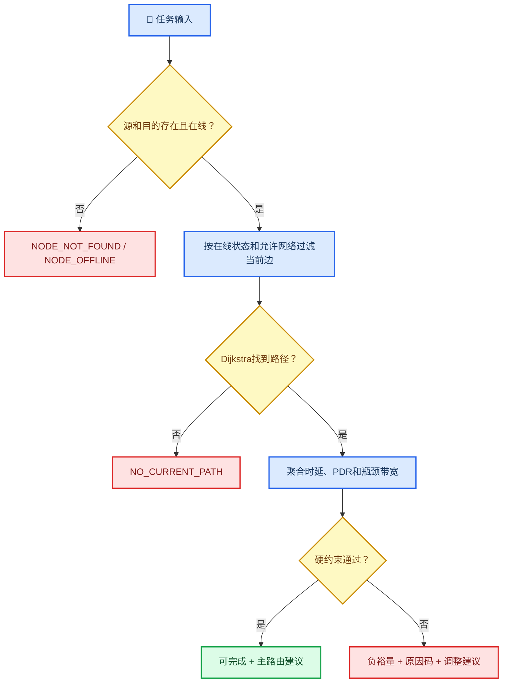

# 任务可达性评估

_功能版本 0.4.0 · 当前启用图硬约束评估 · 最后验证：2026-07-30_

---

## 📋 功能边界

本版本使用同一份不可变资源快照，对AFSIM当前已启用通信图执行可达性、最低预测时延路径
和硬约束检查。输出只读建议，不调用任何链路启停、改频或改路由接口。

`can_establish`在0.4版本仅表示“当前路径已经存在”，尚不表示资源管理器能够建立潜在链路。
候选图、网关虚拟边和备选路由将在后续版本实现。

## 🧭 评估流程



## 🧮 路径与指标

图节点是通信端点，任务输入使用平台名称。同一平台有多个在线端点时，算法将它们作为
多源或多目的候选。边必须同时满足：

- 链路状态为`ONLINE`
- 两端通信端点为`ONLINE`
- 网络类型不是`UNKNOWN`
- 网络类型符合用户的允许网络条件

路径权重为逐跳预测时延。优先使用链路10秒窗口的实测平均传输时延；没有时延样本时，
使用三维距离除以光速的传播时延。路径PDR为逐跳10秒PDR乘积，优先使用链路值，缺失时
回退到同网络窗口值。路径带宽为所有跳有效数据率的最小值。

## 📏 裕量定义

所有裕量保持统一正负方向：

\[
Margin_{bandwidth}=Bandwidth_{bottleneck}-Bandwidth_{required}
\]

\[
Margin_{delay}=Delay_{allowed}-Delay_{predicted}
\]

\[
Margin_{reliability}=PDR_{estimated}-PDR_{required}
\]

正数表示满足且有余量，负数表示不足。若用户输入正的带宽要求，但路径没有有效容量，
返回`DATA_INVALID`，不使用观测吞吐量替代容量。

## 🚨 原因码

| 原因码 | 触发条件 |
| --- | --- |
| `DATA_INVALID` | 必需的PDR或带宽数据无效 |
| `NODE_NOT_FOUND` | 平台名称不存在 |
| `NODE_OFFLINE` | 源或目的没有在线通信端点 |
| `NETWORK_TYPE_UNKNOWN` | 候选边没有明确网络类型 |
| `NO_CURRENT_PATH` | 当前启用图无允许路径 |
| `BANDWIDTH_MARGIN_NEGATIVE` | 瓶颈带宽小于任务要求 |
| `DELAY_MARGIN_NEGATIVE` | 预测时延超过上限 |
| `RELIABILITY_MARGIN_NEGATIVE` | 路径PDR低于要求 |

原因码去重并保持确定性，便于自动验收。

## 🖥️ 页面操作

进入`Task assessment`页，输入源、目的、允许网络和QoS约束，点击
`Evaluate current graph`。结果绑定点击时的`snapshot_version`，页面持续更新资源快照
不会悄悄修改已经显示的评估结论；再次点击才会重新评估。

每次点击还会异步追加到：

```text
output/assessment_results.jsonl
```

schema为`nrm.assessment.v1`，包含四个布尔结论、主路由、网络序列、预测值、裕量、原因码和
建议。

## ✅ 自动测试

`nrm_assessment_evaluator_test`覆盖：

- 两跳路径正常通过
- 带宽裕量为负
- 限定不匹配网络导致当前不可达
- 平台名称不存在
- 路径时延、PDR乘积和瓶颈带宽数值

`nrm_snapshot_reporter_test`覆盖评估结果异步写出和原因码序列化。

## ⚠️ 已知限制

- 只评估当前图，尚无候选建链边。
- 只返回一条主路由，尚无备选路由。
- 当前路径按预测时延最短，不包含综合代价权重。
- 当前不解析跨网网关能力；跨网必须已经存在AFSIM图边。
- `payload_bits`已进入稳定契约，但0.4尚未加入分片和完成时间计算。
- `stable`暂按可完成且路径PDR不低于80%判定，完整稳定性评分仍待实现。

## 🔙 回退

稳定标签为`v0.4.0-assessment-core`：

```bash
git -C /home/pyh/afsim/network_resource_manager worktree add \
  /home/pyh/afsim/nrm-v0.4.0 v0.4.0-assessment-core
```
