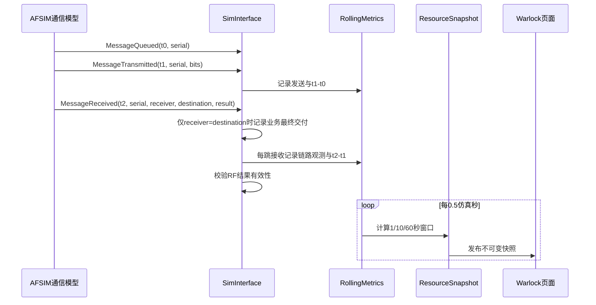

# 通信窗口指标

_功能版本 0.3.0 · 仿真时间滑动窗口与通信结果适配 · 最后验证：2026-07-30_

---

## 📋 功能目标

本功能把AFSIM通信事件转换为可复算的1秒、10秒和60秒窗口指标。它用于回答“最近一段
仿真时间内网络负载、交付情况、在线状态和时延如何”，不负责判断通信任务是否可完成。

## 🔄 指标处理流程



## 🧮 计算口径

| 指标 | 公式 | 数据来源 |
| --- | --- | --- |
| 提供负载 | 窗口内发送消息比特数/窗口长度 | 同一消息生命周期的首次 MessageTransmitted |
| 交付吞吐量 | 窗口内最终目的端交付比特数/窗口长度 | 目的地址匹配的 MessageReceived |
| 网络PDR | 最终目的端交付消息数/同一发送队列消息数 | 关联 messageId 的单一终态 |
| 在线率 | 窗口内在线端点比例的样本平均 | 周期端点状态快照 |
| 平均排队时延 | `mean(t_transmit-t_queue)` | 相同消息序列号 |
| 平均传输时延 | `mean(t_receive-t_transmit)` | 相同消息序列号 |
| 链路交付吞吐量 | 成功接收比特数/窗口长度 | 定向收发端点对 |
| 链路利用率 | 链路交付吞吐量/有效数据率 | `WsfCommResult.mDataRate` |

所有时间差先使用AFSIM统一仿真时钟计算，再换算为毫秒。关联缓存和指标样本最多保留60秒，
避免长时间仿真导致内存持续增长。

## 🛡️ 有效性规则

`MetricValue`同时保存值、单位、`valid`、来源、置信度、采样时间和窗口。规则如下：

- PDR在窗口没有发送消息时无效，不能解释为0%。
- 排队或传输事件无法按序列号关联时，对应时延无效。
- 数据率必须大于0才可作为带宽和利用率分母。
- 接收功率必须大于0瓦才转换为RSSI。
- 绝对信噪比必须大于0才转换为dB。
- BER必须不小于0；AFSIM默认哨兵值`-1`无效。
- 无效字段在GUI显示`—`，JSON保留`valid=false`。

## 🖥️ 页面映射

`窗口指标`默认“运行摘要”每个网络显示一行10秒数据；“1/10/60秒技术明细”仍显示三行。
窗口越短，对突发通信越敏感；窗口越长，趋势越稳定：

| 窗口 | 推荐用途 |
| ---: | --- |
| 1秒 | 突发负载和即时变化 |
| 10秒 | 默认演示、验收和后续评估输入 |
| 60秒 | 长时趋势与稳定性 |

`Links`页显示10秒链路交付吞吐量。带宽和利用率只有物理通信模型填充有效数据率时显示。

## 📄 上报字段

JSONL的网络和链路对象包含`windows`数组。CSV每个网络、每个快照、每个窗口写一行，并保留
空字段表示无效值。`nrm.snapshot.v2`新增camelCase字段，同时保留v0.6的snake_case字段作为
兼容别名；两者来自同一个指标对象。典型兼容字段如下：

```json
{
  "window_s": 10,
  "transmitted": 1,
  "received": 1,
  "transmitted_bits": 1024,
  "throughput_bps": {
    "value": 102.4,
    "unit": "bit/s",
    "valid": true,
    "source": "DERIVED",
    "confidence": "HIGH",
    "window": 10
  },
  "pdr_percent": {
    "value": 100,
    "unit": "percent",
    "valid": true
  }
}
```


## ⚠️ 已知限制

- 严格交付率仅在接收端地址等于消息最终目的地址时记录`messageId`单一终态，尚未展开组播预期接收者口径。
- 重复生命周期回调不会重复计数；重传序号仍依赖AFSIM上游提供可关联标识。
- 当前输出平均值、P50和P95；抖动、ACK和RTT仍待实现。
- 链路发送尝试缺少可靠分母时PDR保持无效，不用成功接收构造100%。
- 通用抽象网络不产生RF链路预算结果，RF列保持无效。

## 🔙 回退

本功能完成后使用标签`v0.3.0-metrics`。需要隔离验证旧版时创建新工作区，不在当前工作区
执行破坏性重置：

```bash
git -C /home/pyh/afsim/network_resource_manager worktree add \
  /home/pyh/afsim/nrm-v0.3.0 v0.3.0-metrics
```
