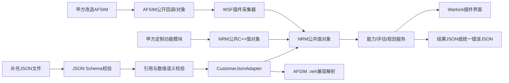

# 甲方精简 JSON 接口基线设计

_设计状态：待用户书面审阅 · 设计日期：2026-08-13 · 对应方案：A_

## 1. 目标

甲方系统同样基于AFSIM改造，本项目交付物是安装到其AFSIM源码树并重新编译的WSF扩展插件
和Warlock界面插件，不是脱离AFSIM运行的独立平台。由本项目定义一套精简、稳定、可自动
校验的数据格式：凡插件无法从甲方AFSIM公开接口直接获取、必须由甲方定制模块补充的数据，
均由本项目提供JSON Schema、示例文件和错误码，甲方按该格式生成输入，不再等待甲方另行
设计格式。接口只覆盖合同需要的数据交换，不加入与首期文件联调无关的网络协议和安全设施。

## 2. 冻结原则

1. 所有甲方业务文件使用 UTF-8 JSON，一个文件只包含一个完整消息。
2. 所有消息采用相同公共信封，各模块只定义自己的 `data`。
3. 每类消息提供独立 JSON Schema；正式 JSON 不包含注释，另提供 JSONC 中文注释样例。
4. 字段名携带固定单位，例如 `frequencyHz`、`bandwidthBps`、`delayMs`和`latitudeDeg`。
5. 未知值省略可选字段；必需值缺失则拒绝文件，不用数值 0 表示未知。
6. V1 采用完整快照，不支持 JSON Patch、局部更新、分页和分片。
7. 第一阶段只支持文件加载和文件输出，不实现 TCP、UDP、消息队列、TLS、签名或压缩。
8. 所有输入先通过 Schema 校验和语义校验，再原子发布到内部只读快照。
9. 评估、规划和建议保持只读，不自动建链、改频、分配时隙或切换路由。
10. `.nrm`继续作为 NRM 内部规划存储格式；外部甲方只使用 JSON。
11. 导航同时接受统一 JSON 和 AFSIM 原生 `.neh`，二者进入同一个内部导航对象。
12. 已冻结的 V1 不删除字段、不改变字段语义；不兼容修改发布 V2。
13. 能通过甲方AFSIM公开回调和对象读取的数据优先直接采集，不要求先导出JSON再导入。
14. 甲方定制Link-11、Link-16、卫通、CDL、导航或环境模块不能直接依赖插件内部实现；
    同进程对接使用稳定公共C++值对象，文件对接使用本规范JSON。
15. 插件按源码包迁移并在甲方AFSIM环境重新编译，不承诺动态库跨AFSIM版本保持ABI兼容。

## 3. 公共信封

每类文件使用以下最小结构：

```json
{
  "schema": "nrm.customer.resource_report.v1",
  "messageId": "msg-000001",
  "timestamp": "2026-08-13T10:00:00+08:00",
  "source": "CUSTOMER",
  "data": {}
}
```

| 字段 | 必需 | 规则 |
| --- | --- | --- |
| `schema` | 是 | 精确标识消息种类和主版本 |
| `messageId` | 是 | 本次运行内唯一，1至64字符 |
| `timestamp` | 是 | ISO 8601，包含时区 |
| `source` | 是 | `CUSTOMER`、`AFSIM`、`NRM`或`REPLAY` |
| `data` | 是 | 对应模块的强类型数据对象 |

涉及仿真过程的消息在 `data` 中增加 `runId`和`simTime`。`simTime`单位固定为秒，是仿真
计算时间基准；`timestamp`只用于文件追踪和故障定位。

## 4. 六类业务接口

### 4.1 导航结果输入

Schema：`nrm.customer.navigation_report.v1`

必需数据仅包括：`runId`、`simTime`、`platformId`、`navigationType`、真实位置、感知位置和
三轴位置误差。`navigationType`只允许`GNSS`、`INS`和`INTEGRATED`。速度误差、姿态误差、
导航状态和置信度均为可选字段。AFSIM `.neh`由独立解析器转换成相同内部对象，不要求甲方
把`.neh`嵌入JSON。

对应合同：3.2.1，追踪键`NAV-01`至`NAV-04`。

### 4.2 环境状态输入

Schema：`nrm.customer.environment_report.v1`

必需数据为`runId`、`simTime`和`regionId`。`terrain`、`weather`、`astronomy`和
`interference`均为可选对象；提供某对象时只校验该对象的最小必需字段。环境影响必须声明
`INFORMATION_ONLY`、`ALREADY_INCLUDED`或`CANDIDATE_ADJUSTMENT`，防止同一衰减重复计算。

对应合同：3.2.3交互数据，追踪键`CAP-07`和`CAP-08`。

### 4.3 通信资源状态输入

Schema：`nrm.customer.resource_report.v1`

采用完整快照，必需数据为`runId`、`simTime`、`networks`、`members`和`links`。网络类型只
允许`LINK11`、`LINK16`、`SATCOM`和`CDL`。链路为有向记录。基础链路只要求ID、源成员、
目的成员、网络ID和工作状态；带宽、时延、PDR、RSSI、SNR、BER、队列、流量、路由和消息
统计均按“能够提供就上报”的可选原则处理。提供的数值必须带明确单位字段名和有效性。

对应合同：3.2.5资源状态获取，追踪键`MGR-01`。

### 4.4 任务评估请求与结果

请求Schema：`nrm.customer.assessment_request.v1`；结果Schema：
`nrm.customer.assessment_response.v1`。

请求最少包含`taskId`、源平台、目的平台、业务类型、所需带宽、最大时延和最低PDR。
结果最少包含`reachable`、`canEstablish`、`canComplete`、原因码和建议；存在路径时增加主路由，
存在备选时增加备选路由。裕量统一为“能力减要求”或“允许上限减预测值”，正数满足、负数
不足。结果不包含控制命令。

对应合同：3.2.3能力计算和3.2.5匹配评估，追踪键`CAP-01`至`CAP-06`、`MGR-03`至`MGR-05`。

### 4.5 网链资源规划输入与结果

输入Schema：`nrm.customer.network_plan.v1`；结果Schema：
`nrm.customer.network_plan_result.v1`。

规划输入最少包含`planId`、`revision`、`allocations`和`demands`。allocation只保留网络类型、
频率、信道、子网、成员、时隙和路由策略；没有分配的资源使用空数组或省略可选字段。
Adapter将JSON转换为现有`NetworkPlanDocument`，继续复用`.nrm`版本存储、校验和推演流程。
结果包含结构校验结论、逐需求推演结论、规划状态和本地分发包路径。

对应合同：3.2.4，追踪键`PLAN-01`至`PLAN-03`。

### 4.6 动态入网和退网申请

Schema：`nrm.customer.membership_request.v1`

数据只包含`requestId`、`planId`、`allocationId`、`platformId`和`action`；`action`只允许
`JOIN`或`LEAVE`。处理结果复用统一错误响应，并在成功时输出新的规划revision，不原地修改
已校验修订。

对应合同：3.2.4动态协同，追踪键`PLAN-04`。

## 5. 统一错误响应

Schema：`nrm.customer.error.v1`

```json
{
  "schema": "nrm.customer.error.v1",
  "messageId": "msg-000001",
  "timestamp": "2026-08-13T10:00:01+08:00",
  "source": "NRM",
  "data": {
    "success": false,
    "errors": [
      {
        "code": "REQUIRED_FIELD_MISSING",
        "path": "/data/platformId",
        "message": "缺少平台编号"
      }
    ]
  }
}
```

V1固定错误码：`INVALID_JSON`、`SCHEMA_UNSUPPORTED`、`SCHEMA_VALIDATION_FAILED`、
`REQUIRED_FIELD_MISSING`、`VALUE_OUT_OF_RANGE`、`REFERENCE_NOT_FOUND`、
`DUPLICATE_MESSAGE`、`STALE_DATA`、`DATA_INVALID`和`INTERNAL_ERROR`。`path`使用JSON Pointer。

## 6. 组件与数据流



插件包含两部分：WSF扩展负责AFSIM内部状态采集、公共模型服务和文件适配，Warlock插件负责
可视化和人工操作。`CustomerJsonAdapter`是唯一允许感知甲方JSON字段的组件；AFSIM采集器
只读取甲方版本公开的AFSIM对象和回调。评估器、规划仓库、环境适配器和导航核心继续只依赖
现有C++公共值对象。JSON解析失败不得部分更新当前快照；成功转换后以完整对象替换。日志
记录文件路径、schema、messageId和错误码，不记录安全敏感扩展内容。

对接优先级固定为：

1. AFSIM已有且公开的数据，WSF插件直接监听；
2. 甲方定制模块与插件同进程且能够重新编译时，调用公共C++适配边界；
3. 不适合同进程耦合或需要离线回放的数据，使用本规范JSON文件；
4. 导航历史数据可直接使用AFSIM原生`.neh`。

无论采用哪条入口，数据都必须转换为同一公共值对象，因此界面、评估算法和规划算法不感知
甲方AFSIM内部模块名称，也不因输入方式不同产生两套计算逻辑。

## 7. 精简约束与非目标

V1不包含：提供方握手、序列协商、实时流协议、连接保活、网络鉴权、证书、数字签名、压缩、
分片、增量补丁、自动资源控制和甲方OA集成。也不复制甲方AFSIM已有的仿真调度、平台状态、
通信回调或导航历史机制。若后续必须跨进程实时联调，保持JSON载荷不变，只在外层增加长度帧
或双方确认的传输方式。

现有复杂Schema中超出本设计最小字段集的内容应降为可选或移出V1；不允许为了覆盖所有
可能情况继续增加必需字段。

## 8. 验收标准

1. 六类输入各提供一个最小合法JSON和一个中文JSONC样例。
2. 每个Schema可独立校验合法样例，并拒绝缺失必需字段、错误枚举和非有限数值。
3. 导航JSON与AFSIM `.neh`可转换为同一内部导航对象。
4. 资源规划JSON可无损转换为`NetworkPlanDocument`并完成保存、重新加载和校验。
5. 任务评估请求能得到统一信封响应；无效输入得到固定错误码和JSON Pointer。
6. 任何失败输入都不修改最后一个有效快照或规划。
7. 全部自动测试和现有AFSIM插件构建通过。
8. 在第二套兼容AFSIM源码树中重新编译后，WSF插件和Warlock插件均能被发现和加载。
9. 使用AFSIM内部采集、公共C++适配和JSON文件输入同一类数据时，生成的公共值对象字段
   语义一致。

## 9. 合同与责任边界

本项目向甲方交付可迁移插件源码、构建接入说明、Schema、字段说明、合法样例、错误样例和
离线校验命令。甲方负责在其AFSIM源码环境重新编译插件，并让其定制模块通过公开AFSIM接口、
公共C++适配边界或冻结JSON Schema提供数据。本项目负责监听、解析、校验、内部转换、计算、
显示和结果输出。双方若确认新增字段，优先增加可选字段；任何删除字段或改变语义的要求必须
发布新主版本。

该策略消除“等待甲方提供格式”的开发阻塞，但不代表甲方真实通信参数、算法参数、封装规范、
安全规范和部署环境可以由本项目臆造。缺少真实业务数据时继续使用明确标记的参数化样例，
不得宣称为真实装备数据。
