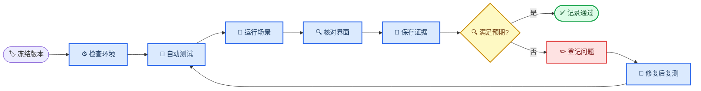

# AFSIM 网络资源管理器合同功能测试明细与执行记录

_适用于 NRM `0.12.1` 内部预验收；用于按合同条款逐项执行、取证、判定和登记问题_

---

## 📋 使用范围与判定口径

本文把合同要求拆成两部分：合同 30 项网络资源指标，以及导航、数据链、通信能力、资源
规划、资源管理、接口、运行环境和兼容扩展等功能条款。合同 30 项中的第 2/19、15/21、
16/22、17/23 为重复条目，执行时可以共用证据，但记录中仍保留原合同序号。

测试依据如下：

- [合同 30 项指标实现矩阵](合同30项指标实现矩阵.md)
- [`requirement_traceability.yaml`](../data/requirement_traceability.yaml)
- [`contract_coverage.yaml`](../data/contract_coverage.yaml)
- [功能使用手册](功能使用手册.md)
- [验证记录](VALIDATION.md)

> ⚠️ **验收边界：** 本文产生的是内部 `PRE_ACCEPTANCE` 证据。参数化 Link-11、
> Link-16、卫通、CDL、导航和环境演示值不代表真实协议栈、装备性能或甲方最终数据。

### 结果状态

| 状态 | 判定规则 |
| --- | --- |
| `PASS` | 操作完成，实际结果满足全部预期，并留存可复核证据 |
| `FAIL` | 软件异常、结果错误、字段缺失、状态未变化或证据不一致 |
| `BLOCKED` | 需要甲方私有对象、正式接口、目标机规范，或当前缺少安全测试入口/测试输入 |
| `NOT_RUN` | 尚未执行，不得按通过统计 |

### 数据质量判定

- `DIRECT`：AFSIM 或甲方数据直接提供，可以按实测值验收
- `DERIVED`：由事件或有效字段计算，必须能说明输入和公式
- `PARAMETERIZED_MODEL`：来源于版本化网络或环境剖面，只能按演示参数验收
- `ESTIMATED`：兼容性降级值，必须显示低置信度，不能冒充真实测量
- `valid=false`：当前模型没有该数据，不得用 `0` 代替，也不能据此判定数值正确

### 执行记录头

每次正式执行前复制并填写下表。工作区非干净状态时，在“Git 修订”后增加 `-dirty`，避免
把不同代码状态下的结果混在一起。

| 记录项 | 填写内容 |
| --- | --- |
| 测试轮次编号 | `NRM-AT-YYYYMMDD-NN` |
| 测试日期与时区 | 填写，统一使用北京时间 |
| 测试人员 | 填写 |
| NRM 版本 | 预期 `0.12.1` |
| Git 分支/修订 | 使用 `git branch --show-current` 和 `git describe --always --dirty` |
| AFSIM 版本 | 当前基线 AFSIM 2.9 Linux 源码环境 |
| 操作系统/硬件 | 引用部署检查结果 |
| 总体结论 | `PASS / FAIL / BLOCKED / NOT_RUN` |

## ⚙️ 测试准备与执行流程

### 标准路径

```bash
cd /home/pyh/afsim/network_resource_manager

./scripts/ai_guard.sh status
./scripts/ai_guard.sh static
./scripts/ai_guard.sh build
```

默认构建目录为：

```text
/home/pyh/afsim/afsim2.9/afsim-2.9.0-kylin_v10_sp1_x86_64/swdev/src/build-ubuntu24
```

如目标机目录不同，执行前设置 `AFSIM_BUILD`。编译、静态检查或插件加载失败时，后续功能
测试全部停止并登记缺陷，不能跳过基础失败继续给出总体通过结论。

Windows PowerShell 可以远程发起一键测试，执行期间通过 VNC 查看 Warlock：

```powershell
ssh -F NUL pyh@10.129.10.207 "cd /home/pyh/afsim/network_resource_manager && ./scripts/run_preacceptance.sh"
```

需要在 Warlock 中人工观察指定场景时，先停止默认服务，再启动对应场景；关闭临时 Warlock
后恢复默认服务：

```bash
systemctl --user stop nrm-warlock.service
./scripts/remote/run-warlock-remote.sh test_mission/link_failure.txt
systemctl --user start nrm-warlock.service
```



### 前端录像检查

面向非技术验收人员时，在VNC的Warlock右侧打开`合同验收演示`，依次点击九个固定步骤。
该入口会自动填充固定任务评估与通信能力参数，并在资源规划步骤自动执行校验和只读推演。
每一步均应录到“中央AFSIM态势 + 右侧中文结果”：

- 四网资源：4类网络可区分，平台和链路来自当前综合场景；
- 任务评估：主路由显示`airborne_relay → network_control_center → gw_l11_l16_reverse`；
- 资源规划：若为`REJECTED`，必须同时拍到原因、数值缺口和中文调整建议；
- 跨域、导航、环境：能从步骤页进入对应实时页面，缺失数据必须显示无效而不是伪造0；
- 预验收：页面只读展示最近一次测试/场景计数，不从GUI启动批量验证。

### 一键基线检查

```bash
./scripts/run_preacceptance.sh
```

当前脚本固定执行：

- 静态一致性检查
- 43 个固定 C++/Shell 测试
- 10 个批准场景
- 本机部署条件检查
- 一次 Warlock 120 秒四网最终快照检查

成功时终端最后显示 `Overall: PASS`。报告和日志位于：

```text
output/preacceptance/<UTC时间戳>-<进程号>/PREACCEPTANCE_REPORT.md
output/preacceptance/<UTC时间戳>-<进程号>/logs/
output/preacceptance/latest_status.json
```

一键基线通过不替代后续 GUI 人工核对，也不替代甲方现场联调。

### 运行结果文件

查找最近一次 Warlock 运行目录：

```bash
RUN_DIR=$(find /home/pyh/afsim/network_resource_manager/output \
  -maxdepth 1 -type d -name 'run-*' | sort | tail -1)
echo "${RUN_DIR}"
```

主要证据文件如下：

| 文件 | 用途 |
| --- | --- |
| `manifest.json` | 运行编号、版本、配置和完成状态 |
| `resource_snapshots.jsonl` | 网络、成员、链路、导航、环境和消息快照 |
| `network_summary.csv` | 四网窗口汇总 |
| `assessment_results.jsonl` | 单任务可达性和主备路由结果 |
| `capability_results.jsonl` | 通信能力查询结果 |
| `plan_validation_results.jsonl` | 规划校验结果和原因码 |
| `plan_evaluation_results.jsonl` | 规划逐需求推演和调整建议 |
| `resource_demand_results.jsonl` | 批量需求匹配结果 |
| `planning_recommendations.jsonl` | 六类结构化只读建议 |
| `resource_alarms.jsonl` | 资源告警记录 |
| `customer_interface_events.jsonl` | 甲方 JSON 接入审计，不保存原始载荷 |

## 📊 合同 30 项资源指标明细

下表的“状态”在执行前统一为 `NOT_RUN`。测试人员执行对应用例后，将状态改为
`PASS / FAIL / BLOCKED`，并在文末执行记录表登记证据或缺陷编号。

| 序号与指标 | 对应用例 | 操作入口 | 关键预期 | 状态 |
| --- | --- | --- | --- | --- |
| 1 链路名称 | A01 | 四网总览、通信链路 | 链路标识非空、稳定且收发方向可区分 | `NOT_RUN` |
| 2 链路可用性 | A02 | 通信链路、快照 | 输出布尔状态和有效性；缺数据不显示伪造的 0 | `NOT_RUN` |
| 3 组网规模 | A01 | 四网总览 | 基线为 4 网、10 端点、8 条有向链路 | `NOT_RUN` |
| 4 链路脱网时长 | A08 | 断链场景 | 断链期间累计，恢复后当前脱网时长复位 | `NOT_RUN` |
| 5 建链成功率 | A07 | 固定测试、通信链路 | 有事件时正确计算；无事件时为无效而非伪造值 | `NOT_RUN` |
| 6 建链时长 | A07 | 固定测试、通信链路 | 成功时为成功时间减尝试时间，并标明来源 | `NOT_RUN` |
| 7 链路工作状态 | A03 | 拓扑、通信链路 | 禁用和恢复后状态按仿真事件变化 | `NOT_RUN` |
| 8 成员名称 | A01 | 网络成员 | 与 AFSIM 平台名称一致 | `NOT_RUN` |
| 9 成员编号 | A01 | 网络成员 | 端点编号/地址非空且同一运行内唯一 | `NOT_RUN` |
| 10 成员职责 | A01 | 网络成员 | 显式职责优先；推断职责标记估算和低置信度 | `NOT_RUN` |
| 11 成员在网状态 | A08 | 网络成员 | 在线、离线、未知状态可区分 | `NOT_RUN` |
| 12 成员在网率 | A08 | 窗口指标 | 按窗口积分且范围为 0%～100% | `NOT_RUN` |
| 13 成员位置 | A01 | 态势图、网络成员 | 经纬高或位置字段有效，移动平台位置更新 | `NOT_RUN` |
| 14 传输距离 | A05 | 通信链路 | 由有效 RF 结果或端点几何计算，单位为米 | `NOT_RUN` |
| 15 链路应答时延 | A02 | 窗口指标 | ACK、响应、RTT 可区分；估算值明确标源 | `NOT_RUN` |
| 16 链路传输时延 | A02 | 窗口指标 | 排队、单向传输时延按统一仿真时间计算 | `NOT_RUN` |
| 17 链路通信质量 | A05 | 总览、通信链路 | 展示有效质量证据；无 RF 数据显示“—” | `NOT_RUN` |
| 18 可用频段 | A12 | 通信链路、规划 | 四网剖面频率集合可读并可用于候选推荐 | `NOT_RUN` |
| 19 链路可用性 | A02 | 同第 2 项 | 与第 2 项复用同一口径和证据 | `NOT_RUN` |
| 20 承载业务类型 | A06 | 通信链路、规划/需求匹配 | 业务类型集合可见，不支持的业务被拒绝或提示 | `NOT_RUN` |
| 21 链路应答时延 | A02 | 同第 15 项 | 与第 15 项复用同一口径和证据 | `NOT_RUN` |
| 22 链路传输时延 | A02 | 同第 16 项 | 与第 16 项复用同一口径和证据 | `NOT_RUN` |
| 23 链路通信质量 | A05 | 同第 17 项 | 与第 17 项复用同一口径和证据 | `NOT_RUN` |
| 24 链路资源占用率 | A04 | 窗口指标 | 拥塞阶段明显上升，结束后随窗口逐步恢复 | `NOT_RUN` |
| 25 链路队列占用率 | A11 | 窗口指标 | 深度/上限计算正确；默认上限必须标为估算 | `NOT_RUN` |
| 26 业务流量 | A02 | 四网总览、窗口指标 | 消息发送后流量和包数增加，方向可区分 | `NOT_RUN` |
| 27 路由信息 | A06 | 态势图、任务评估 | 当前、实际、候选路由视角不混淆 | `NOT_RUN` |
| 28 消息统计信息 | A02 | 四网总览、窗口指标 | 基线最终为发送 8、接收 8、丢弃 0、路由失败 0 | `NOT_RUN` |
| 29 链路 RSSI | A05 | 通信链路 | 有效正功率才换算 dBm；无效时显示“—” | `NOT_RUN` |
| 30 链路带宽 | A10 | 通信链路、通信能力 | 区分配置容量、已用能力和剩余/可准入能力 | `NOT_RUN` |

## 🔍 资源指标详细用例

### A01 四网资源发现与基础信息

| 项目 | 内容 |
| --- | --- |
| 覆盖条款 | 合同指标 1、3、8、9、10、13 |
| 自动类型 | 场景测试 + 最终快照断言 |
| 输入 | `test_mission/four_network_overview.txt` |
| 主要证据 | 场景日志、`resource_snapshots.jsonl`、界面截图 |

执行：

```bash
./scripts/ai_guard.sh scenario four_network_overview
```

在 VNC 的 Warlock 中检查“四网总览”“网络成员”“通信链路”和中央态势图。

默认远程服务未运行时，可以用下列命令直接打开该场景：

```bash
./scripts/remote/run-warlock-remote.sh test_mission/four_network_overview.txt
```

预期结果：

- 同时出现 `LINK11`、`LINK16`、`SATCOM`、`CDL`
- 最终快照包含 4 个网络、10 个通信端点、8 条有向链路
- 四类网络各发送 2 条并接收 2 条消息
- 成员名称、编号、位置和网络归属正确
- 移动平台在态势图中随仿真时间更新位置

### A02 消息、流量、可用性与时延

| 项目 | 内容 |
| --- | --- |
| 覆盖条款 | 合同指标 2、15、16、19、21、22、26、28 |
| 自动类型 | 四网场景 + 生命周期固定测试 |
| 输入 | `four_network_overview`、`nrm_message_lifecycle_tracker_test` |
| 主要证据 | `resource_snapshots.jsonl`、`network_summary.csv` |

执行包含固定测试、四网场景和最终快照检查的一键预验收：

```bash
./scripts/run_preacceptance.sh
```

预期结果：

- 120 秒最终消息统计为发送 8、接收 8、丢弃 0、路由失败 0
- 消息排队、发送、接收事件能够关联时，输出排队和传输时延
- 没有事务标识时，ACK/响应/RTT 只能标记为估算或无效
- 所有时延非负、单位明确、样本时间不晚于当前快照
- 可用性字段保留 `valid/source/confidence`，无样本时不按 0% 处理

### A03 链路工作状态变化

| 项目 | 内容 |
| --- | --- |
| 覆盖条款 | 合同指标 7 |
| 自动类型 | 故障场景标记 + GUI 人工检查 |
| 输入 | `test_mission/link_failure.txt` |
| 主要证据 | 场景日志、断链和恢复截图、快照 |

执行：

```bash
./scripts/ai_guard.sh scenario link_failure
```

人工检查时用 Warlock 打开同一场景，在 100 秒、120 秒、300 秒和 320 秒附近观察 Link-16
链路状态。

预期结果：

- 100 秒出现 `LINK_FAILURE ACTIVE`
- 禁用期间链路不可用，拓扑和明细状态同步变化
- 300 秒出现 `LINK_FAILURE RECOVERED`
- 恢复后消息能够再次发送，状态不会长期停留在故障态

### A04 链路资源占用率

| 项目 | 内容 |
| --- | --- |
| 覆盖条款 | 合同指标 24 |
| 自动类型 | 拥塞场景 + 窗口指标人工检查 |
| 输入 | `test_mission/congestion.txt` |
| 主要证据 | 窗口指标截图、快照、场景日志 |

执行：

```bash
./scripts/ai_guard.sh scenario congestion
```

预期结果：

- 100～250 秒持续产生 CDL 负载，日志出现 `CONGESTION ACTIVE`
- CDL 提供负载、吞吐量和占用率相对稳态明显上升
- 占用率限制在 0%～100%，原始超额负载由独立字段表达
- 260 秒停止注入后，窗口值随统计窗口逐步下降

## 📊 资源质量、路由与状态测试

### A05 距离、质量与 RSSI 有效性

| 项目 | 内容 |
| --- | --- |
| 覆盖条款 | 合同指标 14、17、23、29 |
| 自动类型 | 低质量剖面场景 + 固定测试 |
| 输入 | `quality_degradation.txt`、`network_profiles_low_quality.nrm` |
| 主要证据 | 通信链路截图、评估原因码、快照 |

执行：

```bash
NRM_NETWORK_PROFILE_CONFIG=/home/pyh/afsim/network_resource_manager/config/network_profiles_low_quality.nrm \
  ./scripts/ai_guard.sh scenario quality_degradation
```

预期结果：

- 距离字段为非负米值，并能随平台几何变化
- 低质量剖面只影响候选能力，来源为 `PARAMETERIZED_MODEL`
- 质量不足时出现可解释的 PDR、时延或质量原因码
- 通用通信模型没有有效 RF 结果时，RSSI/SNR/BER 显示“—”且 `valid=false`
- 不得用 `0 dBm`、`0 dB` 或 `BER=0` 冒充缺失测量

### A06 承载业务和路由信息

| 项目 | 内容 |
| --- | --- |
| 覆盖条款 | 合同指标 20、27 |
| 自动类型 | 任务评估 + 综合协同场景 |
| 输入 | `four_network_overview.txt`、`operational_strike_demo/interactive.txt` |
| 主要证据 | 中央态势图、`assessment_results.jsonl` |

在“任务评估”页选择源、目的、允许网络、带宽、最大时延和最低 PDR，点击“评估当前网络与
候选网络”，核对当前/候选路由。承载业务类型通过“通信链路”字段、规划需求、需求匹配和
`nrm_resource_demand_matching_test`验证；当前任务评估页没有业务类型选择框，不能把路由
评估按钮记录成业务类型人工测试证据。

预期结果：

- 自动需求匹配中，业务类型与网络承载能力不匹配时给出固定原因码
- 当前路径只包含已启用链路，候选路径使用虚线或明确标记
- 主路由和备选路由在界面及 JSONL 中一致
- 跨网路径只能经过显式授权网关，不能由多网平台自动拼接

### A07 建链成功率和建链时长

| 项目 | 内容 |
| --- | --- |
| 覆盖条款 | 合同指标 5、6 |
| 自动类型 | 固定 C++ 测试 |
| 输入 | `nrm_contract_metric_enricher_test`、统一建链事件 |
| 主要证据 | 固定测试日志、快照字段 |

执行：

```bash
./scripts/ai_guard.sh test
```

预期结果：

- 有尝试和成功事件时，成功率为成功次数除以尝试次数
- 建链时长为成功时刻减尝试时刻，不能使用 `LinkAdded` 冒充协议建链
- 无真实建链事件时字段保持无效，或使用明确标注的候选剖面估值
- `valid/source/confidence` 与数值来源一致

### A08 成员在线率和链路脱网时间

| 项目 | 内容 |
| --- | --- |
| 覆盖条款 | 合同指标 4、11、12 |
| 自动类型 | 断链场景 + 状态积分固定测试 |
| 输入 | `link_failure.txt`、`nrm_contract_metric_enricher_test` |
| 主要证据 | 成员/链路页面、窗口指标、快照 |

预期结果：

- 故障期间当前脱网时长随仿真时间递增
- 恢复后当前脱网时长复位，窗口脱网累计仍反映历史故障
- 在线率始终处于 0%～100%
- 没有状态样本时显示未知或无效，不默认判为在线

## 🌐 网关、能力与协议资源测试

### A09 显式跨域网关

| 项目 | 内容 |
| --- | --- |
| 覆盖条款 | 项目补充验收：资源管理、路由信息、跨网建议；不是合同 30 项独立序号 |
| 自动类型 | 单链跨域场景 + 综合级联场景 |
| 输入 | `cross_domain_gateway_smoke.txt`、综合协同场景 |
| 主要证据 | 网关日志、实际跳、态势图 |

执行：

```bash
./scripts/ai_guard.sh scenario cross_domain_gateway_smoke
./scripts/validate_operational_strike_demo.sh
```

预期结果：

- `Link-11 → SATCOM → CDL` 示例恰好完成 2 次授权网关转发
- 综合场景覆盖四网两两组合的 6 组网关和 2 条双网关级联路由
- 综合场景恰好记录 10 次网关逐跳转发
- 未声明的网络、消息类型、源/目的平台或方向不能通过网关

### A10 链路带宽和通信能力

| 项目 | 内容 |
| --- | --- |
| 覆盖条款 | 合同指标 30、通信数据链能力模型 |
| 自动类型 | 能力服务固定测试 + GUI 查询 |
| 输入 | `capability_service_smoke.txt` |
| 主要证据 | 通信能力页面、`capability_results.jsonl` |

执行：

```bash
./scripts/ai_guard.sh scenario capability_service_smoke
```

在“通信能力”页选择源和目的平台，设置网络、带宽、时延和 PDR 后点击“查询通信能力”。

录像场景默认选择`空中中继 -> 频谱监测机`。Warlock运行10秒以上后执行：

```bash
./scripts/validate_live_link_metrics.sh
```

预期结果：

- 返回距离、配置容量、当前负载、剩余能力、预计时延和 PDR
- 实机断言同时通过发送分母、接收数、吞吐、PDR、时延、占用率和AFSIM物理层带宽
- 能力不足时给出负裕量和固定原因码
- 实测值、剖面值和估算值不能混用来源标记
- 查询只读，不修改 AFSIM 链路、频率或路由

### A11 队列占用率

| 项目 | 内容 |
| --- | --- |
| 覆盖条款 | 合同指标 25 |
| 自动类型 | 消息生命周期固定测试 + 拥塞场景 |
| 输入 | `congestion.txt`、`nrm_message_lifecycle_tracker_test` |
| 主要证据 | 窗口指标、快照、告警 |

预期结果：

- 队列占用率按活动深度除以有效上限计算
- 无公开队列上限时使用默认 128，并标记 `ESTIMATED/LOW`
- 只能获取长度时显示队列深度，不伪装成未经验证的百分比
- 拥塞期间队列深度或占用率应高于稳态窗口

### A12 可用频段和协议资源

| 项目 | 内容 |
| --- | --- |
| 覆盖条款 | 合同指标 18、数据链协议和不同频点特性 |
| 自动类型 | 网络剖面、频点特性和协议资源固定测试 |
| 输入 | `config/network_profiles.nrm`、四网规划样例 |
| 主要证据 | 固定测试日志、链路页面、规划页面 |

执行：

```bash
./scripts/ai_guard.sh test
```

预期结果：

- Link-11、Link-16、卫通和 CDL 分别具有版本化候选频率集合
- 占用频率及干扰保护带重叠的候选频率不能被推荐
- Link-11 轮询、Link-16 时隙、卫通波束/信道、CDL 信道资源可以区分
- 独立频点特性库尚未完全接入运行主链时，状态记录为组件级而非完整运行时通过

## 🎯 合同功能测试明细

### F01 AFSIM 原生卫星/惯性导航

| 项目 | 内容 |
| --- | --- |
| 合同条款 | `3.2.1` 卫星导航与惯性导航计算 |
| 输入 | `test_mission/navigation_errors.txt`、AFSIM `.neh` |
| 自动命令 | `./scripts/ai_guard.sh scenario navigation_errors` |
| 人工入口 | `./scripts/remote/run-navigation-warlock.sh`，查看“导航状态” |

预期结果：

- 日志依次包含 `INS`、`PERFECT`、`GPS1`、`GPS2`
- `/tmp/nrm-navigation-history/nav_aircraft.neh` 存在且非空
- 页面显示真实位置、感知位置、纵向/横向/垂向误差和 1σ 精度
- 没有原生误差时，参数化精度标记低置信度，不宣称真实导航积分

### F02 地形、气象、天象和电磁干扰

| 项目 | 内容 |
| --- | --- |
| 合同条款 | `3.2.3`、环境要求 `ENV-01`～`ENV-04` |
| 输入 | `environment_weather.txt`、`data/environment_demo.txt` |
| 自动命令 | `./scripts/ai_guard.sh scenario environment_weather` |
| 人工入口 | `./scripts/remote/run-environment-warlock.sh`，查看“环境状态” |

预期结果：

- 页面显示地形、气象、天象/系统时间、电磁干扰、作业区域和平台姿态状态
- 当前链路不重复叠加环境衰减；环境参数只修正候选能力
- 不同网络类型获得对应容量比例、附加损耗、丢包和时延调整
- 缺少甲方正式环境值时明确显示参数化来源和低置信度

甲方 JSON 样例为
[`environment-report.example.json`](../schemas/customer/v1/examples/environment-report.example.json)。
当前通用环境 JSON 的后端加载链路由 `nrm_customer_data_container_test` 验证；前端没有独立
的通用“加载甲方 JSON”按钮，本轮人工测试使用 AFSIM 场景和环境配置文件。

### F03 通信数据链能力计算

| 项目 | 内容 |
| --- | --- |
| 合同条款 | `3.2.3` 通信数据链能力模型 |
| 自动证据 | `nrm_communication_capability_service_test` |
| 人工入口 | “通信能力”页的“查询通信能力”按钮 |
| 输出 | `capability_results.jsonl` |

预期结果：距离、速率、丢包、时延、吞吐、接入率和环境影响证据均存在；当前已观测路径的
可选地形数据未配置时显示“未配置（不参与当前实测路径判定）”，不单独把结果降为
`DATA_INVALID`。带宽、发送分母、PDR或时延等必要链路数据缺失时仍返回`DATA_INVALID`，并
列出具体缺失项；参数化候选路径缺少环境约束时仍按严格规则判定。

### F04 网链资源规划

| 项目 | 内容 |
| --- | --- |
| 合同条款 | `3.2.4` 网链资源规划模型 |
| 基础样例 | `data/network_plans/four_network_demo-r1.nrm` |
| 复杂样例 | `data/network_plans/operational_25node_complex-r1.nrm` |
| 合同验收样例 | `data/network_plans/contract_acceptance_37node-r1.nrm`（37个平台，含12个跨域网关） |
| 人工入口 | “资源规划”页 |

执行步骤：

1. 点击“加载”，选择规划文件
2. 核对 allocation、成员、频率、信道、子网、时隙和业务需求
3. 点击“校验”并查看“校验问题”
4. 点击“只读推演”并查看“推演结果”和“调整建议”
5. 仅在校验通过且全部需求通过时点击“生成分发包”

预期结果：

- 基础样例显示规划 `four-network-demo`、修订 1、4 条 allocation 和 4 条 demand
- 复杂样例通过 sidecar 自动切换综合场景并恢复规划
- 并发任务按顺序扣减快照副本中的资源，不修改真实 AFSIM 网络
- 不通过的需求显示原因码、数值差距和中文调整建议
- 分发包包含规划正文、校验结果、推演结果和清单文件

### F05 网链资源管理与并发需求匹配

| 项目 | 内容 |
| --- | --- |
| 合同条款 | `3.2.5` 网链资源管理模型 |
| 合同验收需求文件 | `data/resource_demands/contract_acceptance_37node-r1.demand`（12项、覆盖四网） |
| JSON 样例 | `schemas/customer/v1/examples/resource-demand-request.example.json` |
| 自动证据 | `nrm_resource_demand_matching_test`、`nrm_resource_demand_coordinator_test` |
| 输出 | `resource_demand_results.jsonl`、`planning_recommendations.jsonl` |

预期结果：

- 多个任务按优先级顺序执行并发资源扣减
- 每条需求输出路径、规模、距离、带宽、流量、时延、PDR、业务类型 8 项检查
- 明确区分独立失败和与先行任务产生的资源冲突
- 输出频率、站点、信道、子网、时隙和路由 6 类只读建议
- 建议不得自动应用到 AFSIM 网络

当前后端支持精简 JSON 需求集，但“需求匹配”页的文件选择器只直接加载内部 `.nrm/.demand`
格式，仓库没有独立的内部需求样例文件。因此本项的自动化结果可以验收，单独 GUI 文件加载
应记录为当前人工测试入口缺口，不能伪造为已执行。

### F06 跨域网管和显式网关

| 项目 | 内容 |
| --- | --- |
| 合同条款 | 资源管理、路由与跨域协同 |
| 自动命令 | A09 两条命令 |
| 场景规模 | 37 个物理平台、53 个端点、108 条有向链路 |
| 主要证据 | 网关逐跳日志、事件文件、态势图 |

预期结果：所有 6 组网络域组合和 2 条双网关级联路由按显式策略工作；任何未授权转换必须
拒绝。场景中的全部平台属于同一协作体系，不得出现敌方或武器事件。

### F07 甲方 JSON 接口合同

| 项目 | 内容 |
| --- | --- |
| 合同条款 | `3.3` 接口要求 |
| Schema | `schemas/customer/v1/*.schema.json` |
| 正例 | `schemas/customer/v1/examples/*.example.json` |
| 中文例 | `schemas/customer/v1/examples-commented/*.example.jsonc` |

执行：

```bash
./scripts/ai_guard.sh contract
```

预期结果：

- 13 个独立 Schema 均无 `$ref`，可以单文件交付
- 每个字段都有简短中文说明
- 13 个 JSON 正例和 13 个带中文注释 JSONC 样例均通过
- 非法枚举、缺失必填字段、错误引用、重复和乱序输入被拒绝
- 正式集成采用同进程 C++ 适配，JSON 用于字段合同、样例、回放和验收

甲方私有对象头文件、字段映射和 ABI 未提供时，本地测试结论只能是接口基线通过，现场转换
适配仍标记 `BLOCKED`。

### F08 异常恢复与状态生命周期

| 项目 | 内容 |
| --- | --- |
| 合同条款 | `3.4.2` 易用性与异常恢复、运行要求 |
| 自动证据 | 恢复、生命周期、快照报告固定测试 |
| 关注点 | 原子写入、损坏保护、runId 隔离、去重和乱序拒绝 |
| 人工入口 | “预验收状态”页和输出目录 |

预期结果：

- 损坏的恢复文件不会污染有效状态
- 不同 `runId` 数据相互隔离
- 重复 `messageId` 和迟到 `simTime` 按固定规则处理
- 插件结束前排空最终快照和关键输出
- 启动自动恢复策略尚未接入运行主链时，状态保持组件级通过

### F09 模型门面和兼容扩展

| 项目 | 内容 |
| --- | --- |
| 合同条款 | `3.5` 兼容扩展、`4.1-4.2` 设计约束 |
| 自动证据 | `nrm_model_service_facade_test`、`nrm_model_registry_test` |
| 样例证据 | `nrm_reference_model_adapter_test` |
| 人工入口 | 无独立服务管理页面 |

预期结果：模型按名称和精确版本注册、查询健康、调用并卸载；页面与同进程接口复用同一门面；
参考适配器只作为兼容性样例，不宣称已符合甲方尚未提供的正式模型 ABI。

### F10 软件运行环境和部署检查

| 项目 | 内容 |
| --- | --- |
| 合同条款 | `3.4.1` 软件运行环境 |
| 执行命令 | `./scripts/check_deployment_contract.sh` |
| 输出 | `output/deployment_checks.jsonl` |
| 阻塞项 | OA、保密审计、TLS/鉴权、正式模型封装规范 |

预期结果：Linux、CPU、内存、磁盘、网卡、编译器、AFSIM 运行程序、插件源码挂载点和插件
二进制逐项给出结果。甲方尚未提供的规范显示 `CUSTOMER_BLOCKED`，不能伪装成本机通过。

### F11 综合通信协同场景

| 项目 | 内容 |
| --- | --- |
| 合同条款 | 四网资源获取、路由、网关、导航、故障恢复和业务传输联合验证 |
| 执行命令 | `./scripts/validate_operational_strike_demo.sh` |
| GUI 命令 | `./scripts/remote/run-operational-strike-warlock.sh` |
| 主要证据 | `output/operational_strike_validation/console.log`、事件文件、截图 |

预期结果：

- 恰好创建 37 个协作平台，不包含敌对元素
- 观察到四网业务接收、Link-16 直连故障和恢复、CDL 高速业务
- 观察到 10 次显式网关逐跳转发
- 两条级联路由各经过 2 个网关
- 不出现 `WEAPON_FIRED/HIT/MISSED/TERMINATED`
- 最后出现 `SCENARIO_COMPLETE` 和 `Simulation complete`

### F12 一键内部预验收

| 项目 | 内容 |
| --- | --- |
| 覆盖范围 | 静态、固定测试、10 场景、部署检查、Warlock 最终快照 |
| 执行命令 | `./scripts/run_preacceptance.sh` |
| GUI 入口 | “预验收状态”页，只读自动刷新 |
| 通过标志 | 终端 `Overall: PASS`，页面显示“通过” |

预期结果：43 个固定测试全部通过，10 个批准场景全部通过，最终四网快照满足 4 网、10 端点、
8 链路、发送 8、接收 8、丢弃 0、路由失败 0。任一子项失败时总体必须为 `FAIL`。

## 📝 执行记录与问题闭环

### 用例执行汇总

| 用例 | 自动结果 | 人工结果 | 证据或缺陷编号 | 人员/日期 |
| --- | --- | --- | --- | --- |
| A01 四网发现 | `NOT_RUN` | `NOT_RUN` | 填写 | 填写 |
| A02 消息与时延 | `NOT_RUN` | `NOT_RUN` | 填写 | 填写 |
| A03 链路状态 | `NOT_RUN` | `NOT_RUN` | 填写 | 填写 |
| A04 资源占用 | `NOT_RUN` | `NOT_RUN` | 填写 | 填写 |
| A05 距离与质量 | `NOT_RUN` | `NOT_RUN` | 填写 | 填写 |
| A06 业务与路由 | `NOT_RUN` | `NOT_RUN` | 填写 | 填写 |
| A07 协议建链 | `NOT_RUN` | `NOT_RUN` | 填写 | 填写 |
| A08 在网与脱网 | `NOT_RUN` | `NOT_RUN` | 填写 | 填写 |
| A09 跨域网关 | `NOT_RUN` | `NOT_RUN` | 填写 | 填写 |
| A10 带宽与能力 | `NOT_RUN` | `NOT_RUN` | 填写 | 填写 |
| A11 队列占用 | `NOT_RUN` | `NOT_RUN` | 填写 | 填写 |
| A12 频段与协议资源 | `NOT_RUN` | `NOT_RUN` | 填写 | 填写 |
| F01 导航 | `NOT_RUN` | `NOT_RUN` | 填写 | 填写 |
| F02 环境 | `NOT_RUN` | `NOT_RUN` | 填写 | 填写 |
| F03 通信能力 | `NOT_RUN` | `NOT_RUN` | 填写 | 填写 |
| F04 资源规划 | `NOT_RUN` | `NOT_RUN` | 填写 | 填写 |
| F05 需求匹配 | `NOT_RUN` | `NOT_RUN` | 填写 | 填写 |
| F06 跨域网管 | `NOT_RUN` | `NOT_RUN` | 填写 | 填写 |
| F07 接口合同 | `NOT_RUN` | `NOT_RUN` | 填写 | 填写 |
| F08 状态恢复 | `NOT_RUN` | `NOT_RUN` | 填写 | 填写 |
| F09 兼容扩展 | `NOT_RUN` | `NOT_RUN` | 填写 | 填写 |
| F10 部署检查 | `NOT_RUN` | `NOT_RUN` | 填写 | 填写 |
| F11 综合场景 | `NOT_RUN` | `NOT_RUN` | 填写 | 填写 |
| F12 一键预验收 | `NOT_RUN` | `NOT_RUN` | 填写 | 填写 |

### 单项问题记录模板

```text
问题编号：NRM-BUG-YYYYMMDD-NN
对应用例：Axx / Fxx
合同条款：
软件版本和Git修订：
前置条件：
复现步骤：
预期结果：
实际结果：
日志/截图/JSONL路径：
数据来源和置信度：
严重程度：阻断 / 严重 / 一般 / 建议
处理状态：新建 / 修复中 / 待复测 / 已关闭 / 甲方阻塞
```

### 总体通过条件

本轮内部预验收只有同时满足以下条件才能记录为 `PASS`：

1. A01～A12 和 F01～F12 中所有可在本机执行的项目均为 `PASS`
2. 没有未关闭的“阻断”或“严重”缺陷
3. 所有估算和参数化数据均正确标明来源和置信度
4. 所有 `BLOCKED` 项均明确写出所需甲方输入，不计入本机通过数
5. 一键预验收报告、人工截图、JSONL 和缺陷记录能够相互对应
6. 测试记录包含准确的 Git 修订和运行目录，不引用被后续运行覆盖的临时结果

> 📌 **交付建议：** 向师兄或甲方提交时，将本文、最近一次
> `PREACCEPTANCE_REPORT.md`、部署检查 JSON、关键截图和对应 `run-*` 目录共同打包，
> 不要只提交一张“总体通过”截图。

---

_维护规则：合同条款、测试输入、固定原因码或场景规模变化时，必须在同一提交中更新本文。_
