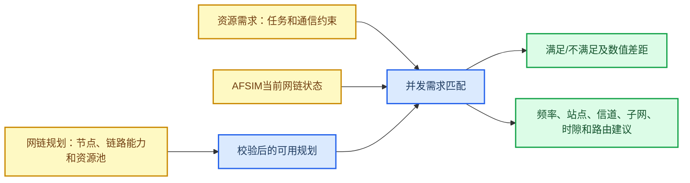
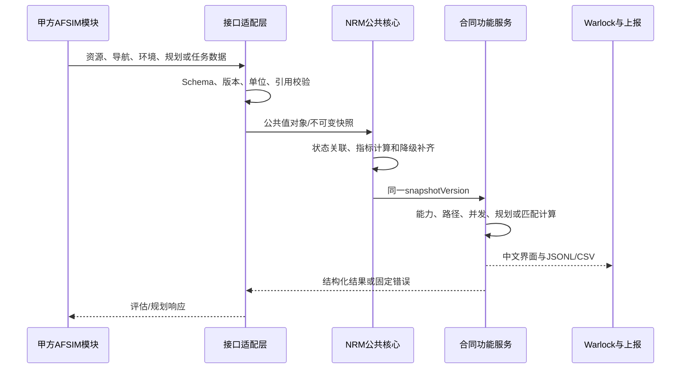

# 当前系统架构与甲方接口边界说明

_AFSIM 网络资源管理器 0.11.x · 面向内部开发、甲方接口评审和合同验收 · 2026-08-13_

---

## 📋 文档结论

网络资源管理器以 **AFSIM WSF 扩展 + Warlock 可视化插件** 的方式部署在甲方改造版
AFSIM 中，不是独立平台，也不要求甲方按我们的内部类结构开发。双方只需要对齐本文件
标出的接口载荷；资源采集、合同指标计算、任务评估、并发资源评估、规划校验和界面展示
均由本插件内部完成。

对接原则如下：

1. 甲方四网、导航、环境模块已经存在时，优先在同一 AFSIM 进程中传递公共 C++ 值对象。
2. JSON Schema V1用于字段合同、测试、回放和文件导入导出，不要求建设独立网络服务。
3. 甲方只提供其实际拥有的字段；缺失字段由插件按降级规则补齐或标记无效。
4. 有效甲方数据优先，插件的参数化值和估算值不得覆盖有效输入。
5. 第一阶段只输出状态、评估和建议，不控制甲方模块建链、改频、切路由或下发规划。

## 🏗️ 总体架构

```mermaid
flowchart LR
    accTitle: AFSIM网络资源管理器总体架构
    accDescr: 甲方AFSIM模块或内置AFSIM事件经适配层进入统一数据核心，再由合同功能服务计算并输出到Warlock界面、JSON报告或甲方模块。

    subgraph data_sources ["外部与AFSIM数据源"]
        afsim_runtime["AFSIM内置通信、平台、导航和环境状态"]
        customer_modules["甲方Link-11、Link-16、卫通、CDL等模块"]
        customer_files["甲方导航、环境、规划和需求文件"]
    end

    subgraph boundary ["需要双方对齐的接口边界"]
        cpp_adapter["CustomerNrmAdapter同进程入口"]
        json_adapter["CustomerJsonCodec文件/测试工具"]
        validation["版本、单位、引用和有效性校验"]
    end

    subgraph plugin_core ["NRM插件内部公共核心"]
        snapshot["统一资源快照"]
        evidence["消息生命周期与状态账本"]
        metrics["30项合同指标与降级补齐"]
        profiles["四网参数剖面与环境影响"]
    end

    subgraph contract_services ["合同功能模块"]
        capability["通信与数据链能力计算"]
        assessment["单任务和并发任务评估"]
        planning["网链资源规划"]
        management["网链资源管理与需求匹配"]
        navigation["导航结果解析与展示"]
    end

    subgraph outputs ["展示与输出"]
        warlock["Warlock中文可视化"]
        reports["JSONL、CSV、日志和本地规划包"]
        customer_output["甲方评估响应和规划结果"]
    end

    afsim_runtime --> cpp_adapter
    customer_modules --> cpp_adapter
    customer_files --> json_adapter
    cpp_adapter --> validation
    json_adapter --> validation
    validation --> snapshot
    snapshot --> evidence
    evidence --> metrics
    profiles --> metrics
    metrics --> capability
    metrics --> assessment
    metrics --> planning
    metrics --> management
    snapshot --> navigation
    capability --> warlock
    assessment --> warlock
    planning --> warlock
    management --> warlock
    navigation --> warlock
    capability --> reports
    assessment --> reports
    planning --> reports
    management --> reports
    reports --> customer_output

    classDef source fill:#f3f4f6,stroke:#6b7280,stroke-width:2px,color:#1f2937
    classDef interface fill:#fef9c3,stroke:#ca8a04,stroke-width:2px,color:#713f12
    classDef core fill:#dbeafe,stroke:#2563eb,stroke-width:2px,color:#1e3a5f
    classDef output fill:#dcfce7,stroke:#16a34a,stroke-width:2px,color:#14532d

    class afsim_runtime,customer_modules,customer_files source
    class cpp_adapter,json_adapter,validation interface
    class snapshot,evidence,metrics,profiles,capability,assessment,planning,management,navigation core
    class warlock,reports,customer_output output
```



黄色区域是双方需要对齐的边界。蓝色区域全部是插件内部实现，甲方不需要理解其中的算法
类，也不需要提供同名模块。

## 🧩 插件内部模块划分

| 层级 | 模块 | 主要职责 | 是否需要甲方对齐 |
| --- | --- | --- | --- |
| AFSIM接入 | `NrmSimInterface` | 监听通信事件、平台状态、网络图及导航/环境状态 | 否，使用AFSIM现有接口 |
| 外部适配 | `ContractInterfaceAdapter`、`CustomerNrmAdapter`、`CustomerJsonCodec` | 私有对象转换、同进程执行及文件测试 | **是** |
| 公共数据 | `ResourceSnapshot`及导航、环境、规划、需求值对象 | 冻结内部统一数据语义 | 只对齐输入输出语义 |
| 状态证据 | `MessageLifecycleTracker`、`ResourceEventLedger` | 消息关联、状态积分、建链和故障事件 | 否 |
| 参数剖面 | `NetworkProfileRepository`、`FrequencyCharacteristicRepository`、`ProtocolResourceModel` | 保存四网默认频点、容量、范围、业务和协议资源 | 甲方有真实参数时可覆盖 |
| 指标补齐 | `ContractMetricEnricher` | 补齐职责、频段、队列占用率和应答时延等合同字段 | 否 |
| 能力计算 | `CommunicationCapabilityService` | 距离、速率、丢包率、时延、吞吐量、接入率 | 否 |
| 路径评估 | `AssessmentEvaluator`、`ConstrainedPathSelector` | 当前/候选路径、主备路由、约束裕量 | 否 |
| 并发评估 | `ConcurrentTaskAssessment`、`DegradationPolicy` | 多任务资源扣减、冲突、接受和降级 | 否 |
| 资源规划 | `NetworkPlanRepository`及规划/协同服务 | 规划加载、编辑、校验、推演、入退网、存储、分发包和ACK | **规划输入/结果需要对齐** |
| 资源管理 | 需求Repository、协调器、匹配服务、建议引擎 | 并发需求匹配、差距、反馈、历史通过率和六类建议 | **需求输入/结果需要对齐** |
| 导航精度 | `AfsimNavigationPacketParser`、`NavigationAccuracyModel` | AFSIM导航解析及缺失精度参数化补齐 | 专用异构包才需对齐 |
| 运行恢复 | `RecoveryStateStore` | 原子保存配置、规划/需求修订和未确认分发包 | 否 |
| 模型封装 | `ModelServiceFacade`、`ModelRegistry` | 统一调用入口、版本和能力注册 | **甲方封装规范需要对齐** |
| 可视化 | `NrmDockWidget`及中央态势视图 | 中文展示合同功能和仿真拓扑 | 否 |
| 上报恢复 | `SnapshotReporter` | JSONL、CSV、日志、运行隔离和异常恢复 | 输出目录由部署时确认 |

### 甲方状态进入统一快照的规则

- `EndpointSnapshot.networkId`和`LinkSnapshot.networkId`是逻辑网络实例主键；
  `networkType`只表示LINK11/LINK16/SATCOM/CDL类别，不能代替实例归属判断。
- `NavigationSample.platformId`是导航状态主键；同一平台再次上报执行更新，不产生重复项。
- 同一`runId`内，资源、导航和环境分别更新、统一合并，任何一个领域更新都不会清空其他领域。
- `messageId`用于有界去重，各领域`simTime`独立判断陈旧消息；新`runId`清空上一运行的
  Customer动态状态。
- 每次被接受的状态更新递增`snapshotVersion`；新快照会使旧评估、能力、规划验证/推演、
  分发就绪状态和需求匹配结果立即失效。

JSON文件入口和未来甲方私有对象薄适配最终都调用同一`CustomerNrmAdapter/DataContainer/
ModelServiceFacade`主链。JSON校验首先经过`CustomerJsonValidationLayer`统一入口，再执行引用、
重复ID和跨对象约束等领域语义校验；当前未引入外部重量级Draft校验库。

## 🔌 需要与甲方对齐的接口

双方接口控制在13类精简业务消息内（新增并发资源需求请求/响应），不要求甲方对齐插件
内部的30项类或算法。

| 接口 | 方向 | 最小必要内容 | 甲方负责 | 插件负责 | Schema/格式 |
| --- | --- | --- | --- | --- | --- |
| 四网资源状态 | 甲方 → NRM | 网络类型、端点、链路状态 | 提供其实际可取得的数据 | 校验、补齐、统计和展示 | `resource-report` |
| 导航结果 | 甲方 → NRM | 平台、仿真时间、导航模式、位置/误差 | 提供AFSIM导航包或结果 | 解析、标准化和展示 | `navigation-report`或`.neh` |
| 环境状态 | 甲方 → NRM | 地形、气象、天象、干扰中的可用项 | 提供其现有数据 | 防重复施加、影响计算和展示 | `environment-report` |
| 任务评估请求 | 甲方 → NRM | 源、目的、业务、带宽、时延、PDR | 提交通信任务要求 | 当前/候选图评估 | `assessment-request` |
| 任务评估响应 | NRM → 甲方 | 满足性、差距、主备路径、建议 | 接收和展示/使用结果 | 生成只读结论 | `assessment-response` |
| 网链规划 | 双向 | 节点、资源池、分配、任务要求 | 提供或接收规划数据 | 校验、推演、存储和结果输出 | `network-plan`/`network-plan-result` |
| 动态入退网 | 甲方 → NRM | 平台、端点、目标网络、加入/退出 | 提供申请 | 校验并纳入规划评估 | `membership-request` |
| 错误响应 | NRM → 甲方 | 原因码、字段路径和说明 | 根据原因修正输入 | 稳定返回诊断 | `error` |

机器可校验文件位于 [`schemas/customer/v1/`](../schemas/customer/v1/README.md)，人工评审可使用
带中文注释的 [`nrm-customer-interface-v1.annotated.jsonc`](../schemas/customer/v1/nrm-customer-interface-v1.annotated.jsonc)。

### 四网资源状态的最小接口

甲方四网模块实现较简单时，不要求一次提供全部合同指标。最小输入只需：

```json
{
  "schemaVersion": "nrm.customer.resource_report.v1",
  "providerId": "customer-afsim-comm",
  "runId": "run-001",
  "sequence": 1,
  "simTime": 10.0,
  "fullSnapshot": true,
  "networks": [],
  "endpoints": [],
  "links": [],
  "gatewayCapabilities": []
}
```

实际联调时，在四个数组内逐步增加甲方已有字段。插件按以下顺序使用数据：

1. 甲方模块有效值；
2. AFSIM内部观测值；
3. 事件推导值；
4. 四网参数剖面值；
5. 估算值；
6. 仍无法得到时输出`valid=false`，但不阻塞其他指标展示。

### 规划和资源需求接口

网链资源规划与网链资源管理是两个相邻但不同的合同模块：



甲方需要对齐的是规划和任务数据，不需要提供我们的匹配算法。甲方无法给出格式时，采用
当前项目定义的精简格式；部署后仅编写适配层，不修改评估核心。

## 🔄 一次数据处理流程



所有时延和状态窗口使用 AFSIM `simTime`，墙钟时间只用于日志。数据适配发生在边界层，
内部服务不读取甲方 JSON，也不保存甲方模块对象或 Qt/AFSIM 裸指针。

## 🧭 甲方无需对齐的内容

以下内容属于插件内部实现，不能作为甲方接口前置条件：

- 30项合同指标的内部结构体和计算类
- 滑动窗口、消息生命周期和状态账本算法
- 当前图、候选图、主备路径和并发资源扣减算法
- 成员职责、ACK/RTT、队列占用率等兼容降级规则
- Warlock表格、中央态势图和中文界面布局
- JSONL/CSV内部归档格式、运行目录和日志组织
- 单元测试、场景测试和Git版本管理方式

甲方只需要确认输入字段能否提供、输出字段能否接收，并在其AFSIM目标树中实现私有对象到
公共值对象的同进程薄转换。JSON文件保留为联调样包和验收证据，不作为运行时前置条件。

## ✅ 联调验收顺序

| 阶段 | 双方动作 | 通过标准 |
| --- | --- | --- |
| 1. Schema确认 | 甲方确认八类消息和单位 | 示例通过`ai_guard.sh contract` |
| 2. 最小样包 | 每类提供一份最小输入 | 能解析并显示网络/平台/任务 |
| 3. 字段扩展 | 增加甲方真实可用字段 | 实测值替代对应降级值 |
| 4. 同进程接入 | 在甲方AFSIM树编译适配器 | 插件加载且快照持续刷新 |
| 5. 合同演示 | 执行四网、规划和并发任务场景 | 合同指标、结论和六类建议可见 |

当前项目接口详细字段见[甲方接口对齐规范与JSON-Schema](甲方接口对齐规范与JSON-Schema.md)，
合同指标对应关系见[合同30项指标实现矩阵](合同30项指标实现矩阵.md)，运行方式见
[运行与可视化入口](运行与可视化入口.md)。
