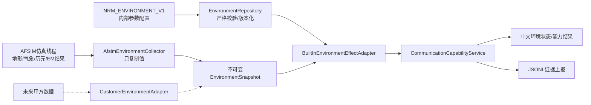

# AFSIM环境影响简要设计

## 1. 目标与边界

本设计为网络资源管理器增加地形、气象、天象和电磁干扰四类环境影响能力。由于甲方无法
提供正式数据格式，第一版采用“AFSIM内置状态优先、内部参数配置补充、缺失数据明确无效”
的策略，不定义或猜测甲方二进制协议。

第一版只完成以下能力：

- 从AFSIM仿真线程采集可直接取得的环境状态和通信交互结果；
- 把四类环境统一转换为不可变值对象；
- 对当前链路解释AFSIM已经产生的影响，对候选链路给出低置信度参数化估计；
- 在通信能力、任务评估、JSONL上报和中文界面中展示来源、时间、有效性和原因码；
- 只输出评估和建议，不自动修改天气、干扰机、频率、路由或链路状态。

第一版不实现数值天气预报、真实电波传播专业软件、空间天气预报、三维地形渲染，也不声称
内部演示参数代表任何真实装备或作战区域。

## 2. AFSIM现有能力复用结论

| 环境域 | AFSIM 2.9可复用能力 | 第一版用法 | 不做内容 |
| --- | --- | --- | --- |
| 地形 | `TerrainInterface`、DTED、GeoTIFF、地形/地平线遮蔽位 | 读取路径遮蔽、端点地面高程和地形数据启用状态 | 自建GIS引擎、三维地形渲染 |
| 气象 | `WsfEnvironment`中的风、云层、雨率、沙尘能见度；ITU衰减组件可使用雨云参数 | 读取场景气象；当前RF结果优先，候选链路按配置剖面估计 | 外部气象网格、预报同化 |
| 天象 | 仿真`start_date/start_time/start_epoch`及Sun/Moon方位、仰角、月相和照明计算 | 计算场景时刻、太阳/月球几何；默认不虚构通信损耗 | 空间天气、太阳活动预报 |
| 电磁干扰 | `WsfEM_Interaction`干扰功率/因子/SNR；`WSF_RF_JAMMER`及通信EW组件 | 优先读取实际通信交互结果；演示场景复用AFSIM干扰机 | 保密干扰样式、真实装备参数 |

直接证据包括：

- AFSIM地形接口：[`WsfTerrain.hpp`](../../afsim2.9/afsim-2.9.0-kylin_v10_sp1_x86_64/swdev/src/core/wsf/source/WsfTerrain.hpp)、
  [`WsfTerrain.cpp`](../../afsim2.9/afsim-2.9.0-kylin_v10_sp1_x86_64/swdev/src/core/wsf/source/WsfTerrain.cpp)和
  [`WsfEM_Interaction.hpp`](../../afsim2.9/afsim-2.9.0-kylin_v10_sp1_x86_64/swdev/src/core/wsf/source/WsfEM_Interaction.hpp)的地形遮蔽状态位；
- AFSIM气象接口：[`WsfEnvironment.hpp`](../../afsim2.9/afsim-2.9.0-kylin_v10_sp1_x86_64/swdev/src/core/wsf/source/WsfEnvironment.hpp)中的风、云、雨和沙尘字段，以及
  [`WsfEM_ITU_Attenuation.cpp`](../../afsim2.9/afsim-2.9.0-kylin_v10_sp1_x86_64/swdev/src/core/wsf/source/WsfEM_ITU_Attenuation.cpp)的雨云衰减入口；
- AFSIM天象接口：[`sun.rst`](../../afsim2.9/afsim-2.9.0-kylin_v10_sp1_x86_64/swdev/src/core/wsf/doc/script/sun.rst)、
  [`moon.rst`](../../afsim2.9/afsim-2.9.0-kylin_v10_sp1_x86_64/swdev/src/core/wsf/doc/script/moon.rst)和
  [`simulation_control_commands.rst`](../../afsim2.9/afsim-2.9.0-kylin_v10_sp1_x86_64/swdev/src/core/wsf/doc/simulation_control_commands.rst)；
- AFSIM干扰接口：`WsfEM_Interaction.hpp`、
  [`WsfEW_CommComponent.cpp`](../../afsim2.9/afsim-2.9.0-kylin_v10_sp1_x86_64/swdev/src/core/wsf_mil/source/ew/WsfEW_CommComponent.cpp)和
  [`WsfRF_Jammer.hpp`](../../afsim2.9/afsim-2.9.0-kylin_v10_sp1_x86_64/swdev/src/core/wsf_mil/source/weapon/WsfRF_Jammer.hpp)。

这些接口是否产生有效数值取决于场景模型和组件配置。接口存在不等于每条通信链路都有
数据，采集器仍必须检查有效位、哨兵值和数值范围。

## 3. 总体架构



实现遵循现有工程边界：

- `include/nrm/`只保存纯C++值对象、校验器和计算接口，不依赖AFSIM或Qt；
- AFSIM对象只允许在仿真线程由`AfsimEnvironmentCollector`读取；
- GUI和评估服务只消费复制后的不可变快照，不保存AFSIM裸指针；
- `EnvironmentEffectAdapter`继续作为统一评估入口，不复制路径搜索算法；
- 配置加载失败不覆盖最后一个有效配置，写入采用新修订和原子替换；
- 所有结果携带`providerId/configVersion/sampleTime/origin/confidence/valid/reason`。

## 4. 最小数据模型

在现有`EnvironmentContext`和`EnvironmentEffect`基础上增加一份只读环境快照：

```text
EnvironmentSnapshot
├── schemaVersion / snapshotVersion / simTime
├── providerId / configVersion / origin / confidence / valid
├── terrain
│   ├── enabled / dataSource / sourceBlocked / destinationBlocked
│   └── pathBlocked / sourceTerrainHeightM / destinationTerrainHeightM
├── weather
│   ├── windSpeedMps / windDirectionDeg
│   ├── rainRateMmPerHour / cloudLowerM / cloudUpperM
│   └── cloudWaterDensityKgM3 / dustVisibilityM
├── celestial
│   ├── epoch / sunElevationDeg / sunAzimuthDeg
│   └── moonElevationDeg / moonIlluminationRatio
└── interference
    ├── interferencePowerW / interferenceFactor
    ├── jammerDetected / jammerIds
    └── affectedFrequencyHz / affectedBandwidthHz
```

重要字段沿用项目的`MetricValue<T>`语义。无效值不能写成0；0只能表示经过校验的真实零值。
建议为`EnvironmentEffect`补充`hardBlocked`和`evidence`字段，避免使用无限大损耗表示地形硬
遮蔽。

统一效果仍输出四项：

| 字段 | 单位 | 含义 |
| --- | --- | --- |
| `pathLossDeltaDb` | dB | 相对基础链路预算增加的损耗 |
| `capacityScale` | ratio | 对候选容量的比例系数，范围0到1 |
| `packetLossDeltaPercent` | percentage_point | 对候选丢包率增加的百分点 |
| `delayDeltaMs` | ms | 对候选链路增加的时延 |

## 5. 内部配置格式

第一版新增严格文本格式`NRM_ENVIRONMENT_V1`，保持与现有网络剖面、规划和需求文件相同的
版本化风格。配置只提供少量演示剖面，不在代码中散落环境常量。

```text
NRM_ENVIRONMENT_V1 "environment-demo-v1" "nrm-parameterized-environment"
ADJUSTMENT "weather-link11" WEATHER LINK11 0.5 0.98 0.2 1.0 0
ADJUSTMENT "weather-link16" WEATHER LINK16 1.0 0.95 0.5 2.0 0
ADJUSTMENT "weather-satcom" WEATHER SATCOM 2.5 0.85 1.5 20.0 0
ADJUSTMENT "weather-cdl" WEATHER CDL 3.0 0.75 3.0 5.0 0
ADJUSTMENT "interference-link16" INTERFERENCE LINK16 3.0 0.75 4.0 10.0 0
```

`ADJUSTMENT`字段依次为：标识、环境域、网络类型、附加路径损耗dB、容量比例、附加丢包
百分点、附加时延ms、硬阻断标志。上述数值仅用于内部预验收，正式发布时必须标记
`PARAMETERIZED_MODEL/LOW`。配置校验拒绝非有限数、未知环境域、未知网络类型、比例超出
0到1、丢包率超出0到100、负损耗/负时延、非法硬阻断标志和多余字段。加载失败不覆盖
最后一个有效配置。

环境变量`NRM_ENVIRONMENT_CONFIG`指向该文件。变量未设置时仍可使用AFSIM直接状态；既无
AFSIM有效数据也无有效配置时，保持`ENVIRONMENT_DATA_UNAVAILABLE`。

## 6. 四类环境的计算规则

### 6.1 地形

1. 当前RF通信首先使用`WsfEM_Interaction`的地形/地平线检查结果；AFSIM已经判定遮蔽时，
   记录`hardBlocked=true`及对应状态位。
2. 第一版在仿真线程对AFSIM图中已有边调用`TerrainInterface::MaskedByTerrain`；没有对应图边
   的纯候选路径保持地形数据无效，不在GUI或评估工作线程跨线程调用地形接口。
3. 地形无遮挡时不额外增加损耗，`capacityScale=1`；遮蔽时路径不可建，不用任意大dB数替代。
4. 地形数据未启用或查询失败时，该域无效，不把“未发现遮蔽”当成“确认无遮挡”。

### 6.2 气象

1. 从`WsfEnvironment`读取风、云、雨率和沙尘能见度。
2. 若场景通信传播组件已经把气象计入`CommResult`，当前链路只报告气象证据，不再次扣减
   RSSI、容量或PDR。
3. 候选链路没有实测结果时，按网络类型和天气剖面读取四项效果；不在代码中实现未经验证的
   自定义雨衰公式。
4. 风主要作为平台运动/导航环境显示，第一版不直接降低通信容量。

### 6.3 天象

1. 使用AFSIM仿真历元而不是Linux墙钟；`start_time_now`仅用于明确要求实时同步的场景。
2. 按路径中点计算太阳/月球方位、仰角和月球照明比例。
3. 第一版默认通信效果为`capacityScale=1`、其余增量为0，只展示几何证据；没有明确规则时
   不编造“太阳导致固定损耗”。
4. 对卫星链路，日月遮挡或视线约束只有AFSIM模型明确判定后才作为硬约束。

### 6.4 电磁干扰

1. 当前通信优先采集`mInterferencePower`、`mInterferenceFactor`和已受影响的SNR/BER；这些
   结果已经进入AFSIM接收判定，不重复扣减。
2. 演示测试优先复用`WSF_RF_JAMMER`和通信EW组件，以“干扰机关/开”形成对照场景。
3. AFSIM通信模型未提供干扰结果时，候选链路才使用配置中的干扰区域和频率重叠规则，结果
   固定为低置信度。
4. 第一版只建模宽带压制的简化效果，不实现欺骗、协议攻击、密码攻击或保密干扰参数。

## 7. 聚合与防止重复计算

对候选链路，四类有效效果按以下简单规则合并：

```text
totalPathLossDeltaDb = sum(valid.pathLossDeltaDb)
totalCapacityScale = product(valid.capacityScale)
totalPacketLossDeltaPercent = sum(valid.packetLossDeltaPercent)
totalDelayDeltaMs = sum(valid.delayDeltaMs)
```

最终容量限制在非负范围，最终丢包率截断到0到100%。任一`hardBlocked=true`时，候选链路直接
判为不可建立。当前链路的容量、PDR、时延和SNR来自AFSIM观测结果，只附加环境证据，不再
应用上述公式。这条规则是第一版必须测试的核心约束。

数据来源优先级固定为：

1. AFSIM当前交互直接结果：`DIRECT/HIGH`或`DIRECT/MEDIUM`；
2. AFSIM场景环境状态推导：`DERIVED/MEDIUM`；
3. 内部配置候选估计：`PARAMETERIZED_MODEL/LOW`；
4. 无数据：`valid=false/ENVIRONMENT_DATA_UNAVAILABLE`。

同一字段只采用最高优先级来源，不对不同来源取平均。

## 8. 界面与上报

在现有“通信能力”结果下保留四类环境明细，并后续增加只读“环境状态”页：

- 地形：数据源、是否启用、路径是否遮蔽、两端地面高程；
- 气象：风、雨、云和能见度，以及所用天气剖面；
- 天象：仿真历元、太阳/月球仰角、月球照明比例；
- 电磁：是否检测干扰、干扰功率、影响因子、频率范围；
- 每项显示来源、置信度、采样时间、有效性和原因码。

`nrm.snapshot.v2`的`environment`对象使用`nrm.environment_snapshot.v1`子模式，能力结果继续
使用现有`environmentEffects`数组。输出
只追加新schema，不改变现有资源快照和能力结果字段含义。

## 9. 失败策略与验收

失败必须可见且不破坏主流程：

- 配置不存在：继续使用AFSIM数据，记录`CONFIG_NOT_PROVIDED`；
- 配置非法：保留最后一个有效修订，记录具体字段和行号；
- AFSIM字段无效：该字段`valid=false`，不使用0替代；
- 数据超过两个快照周期：标记`STALE`，不能用于硬判定；
- 环境全缺失：通信基础评估继续运行，但环境结论为低置信度或数据无效。

`CONFIG_NOT_PROVIDED`、`CONFIG_INVALID`、`DATA_STALE`、`TERRAIN_BLOCKED`和
`INTERFERENCE_OBSERVED`应在实现时加入固定枚举；不得以自由文本代替机器可测试原因码。

固定验收场景建议为：

| 场景 | 注入条件 | 通过标准 |
| --- | --- | --- |
| 基线 | 无地形遮蔽、晴空、无干扰 | 四域可区分，当前通信结果不被重复修正 |
| 地形遮蔽 | DTED/GeoTIFF路径被山体遮挡 | 路径不可建，原因明确为地形遮蔽 |
| 中雨 | AFSIM雨率或内部`moderate_rain`剖面 | 当前链路取AFSIM结果；候选链路标低置信度参数化 |
| 日夜变化 | 固定日期时间分别运行白天/夜间 | 日月角度按仿真历元变化，默认通信容量不变化 |
| 干扰开关 | 同一seed下关闭/开启`WSF_RF_JAMMER` | 干扰功率/SNR/PDR按AFSIM结果变化且不二次扣减 |
| 缺失/坏配置 | 删除配置或注入非法数值 | 不崩溃、不覆盖有效修订、输出固定原因码 |

每个场景固定输入、seed、配置修订和期望JSON。新增纯C++单测覆盖解析、优先级、过期、边界
值、硬遮蔽、聚合和防重复计算；AFSIM场景测试覆盖真实接口读取和干扰开关。

## 10. 分阶段实施建议

第一阶段（建议3到4个工作日）：

- 增加值对象、严格配置解析、AFSIM环境采集和JSONL上报；
- 地形、气象和天象读取AFSIM状态；电磁干扰读取`CommResult`；
- 界面显示四域状态，暂不改变候选路径指标。

第二阶段（建议2到3个工作日）：

- 参数化效果仅接入候选路径；
- 增加地形、天气、日夜和干扰固定场景；
- 完成防重复计算、故障恢复和性能回归。

甲方格式后续到位时，只新增`CustomerEnvironmentAdapter`转换到同一快照，不修改评估算法、
GUI或上报schema。正式联调通过前，内部参数化结果保持`PRE_ACCEPTANCE`，不得提升为
`FINAL_ACCEPTANCE`。
