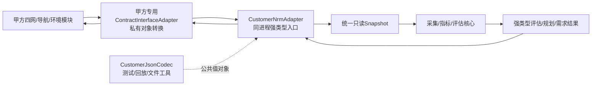

# 网络资源管理器甲方接口对齐规范与 JSON Schema

> 部署形态：本项目是安装进甲方修改版 AFSIM 的 WSF 扩展与 Warlock 插件，不是独立服务端。
> 甲方模块优先在同一进程传递公共 C++ 值对象；需要文件交换时，按本项目定义的精简
> UTF-8 JSON v1 对齐。

机器校验 Schema 位于 `schemas/customer/v1/`，中文可注释示例位于
`schemas/customer/v1/nrm-customer-interface-v1.annotated.jsonc`。当前支持导航、环境、四网资源、
任务评估、并发资源需求、网络规划、规划结果、成员入退网、提供方声明、输入确认和统一错误等13类消息。执行
`./scripts/ai_guard.sh contract` 可验证全部示例。运行时入口还执行V1允许字段、类型、范围、
枚举和引用关系校验，不依赖第三方通用Schema引擎。内部解析已达 `PRE_ACCEPTANCE`；甲方 AFSIM
目标树重编译、真实模块数据和安全策略仍需现场联调。

> Schema 内已使用标准 `title`/`description` 添加中文注解；另提供 [`JSONC 中文注释版`](../schemas/customer/v1/nrm-customer-interface-v1.annotated.jsonc) 供人工评审。正式传输和程序校验仍使用无注释 JSON，字段中文速查见 [`schemas/customer/v1/README.md`](../schemas/customer/v1/README.md)。

_接口基线草案 V1 · 2026-08-11 · 适用于 AFSIM 2.9 网络资源管理器_

## 1. 文档状态与结论

本规范用于与甲方 Link-11、Link-16、卫通、CDL、导航和环境模块对齐数据接口。当前状态为
**项目方接口基线草案**，可以直接用于字段评审、样包制作和联调准备，但只有甲方书面确认后
才能标记为正式接口。

统一 JSON Schema 位于[`schemas/customer/v1/`](../schemas/customer/v1/)；每种消息独立一个
`*.schema.json`，正式样例位于[`examples/`](../schemas/customer/v1/examples/)。

核心设计决定：

1. 甲方模块通过同进程`CustomerNrmAdapter`交互；JSON仅用于接口规范、测试、回放和文件导入导出。
2. V1资源报告是原子全量快照；导航报告按`platformId`原子upsert；环境报告按明确
   提供的子域原子覆盖。三者不共用整域last-writer-wins。
3. 所有算法使用 `simTime`；`generatedAt` 只用于运维追踪，不能参与仿真时延计算。
4. 链路是有方向的；双向链路必须上报两条记录。
5. 缺失或无效物理量不得用 0 代替，必须使用 `valid=false` 和原因码。
6. 多网平台不自动成为网关；跨网只能使用显式 `gatewayCapabilities`。
7. 评估接口只输出结论和建议，不执行建链、改频、切路由或资源调度。

## 2. 对接架构



Schema 是双方字段、单位和语义的数据合同，不是运行时网络协议。当前源码已有同进程
`CustomerNrmAdapter`、抽象对象转换SPI `ContractInterfaceAdapter`和文件工具
`CustomerJsonCodec`。当前文件入口已完成JSON对象到
`ResourceSnapshot`、`NavigationSnapshot`、`EnvironmentContext`、`AssessmentTask`和
`NetworkPlanDocument`的转换。取得甲方实际头文件后，只需实现私有对象到这些公共值对象的
薄转换层，不得把甲方对象、Qt类型或JSON类型传入评估核心。

### 2.1 同进程调用形态

Warlock侧由`DataContainer::GetCustomerNrmAdapter()`暴露入口。甲方专用适配器只负责字段
转换，典型调用如下；正式集成不需要把对象先序列化为JSON：

```cpp
nrm::CustomerCallContext context;
context.runId = customerRunId;
context.messageId = customerMessageId;
context.providerId = "customer-afsim";
context.simTime = simulationTime;
context.hasSimTime = true;

nrm::ResourceSnapshot snapshot = ConvertCustomerResources(customerState);
nrm::CustomerIngestResult result =
   dataContainer.GetCustomerNrmAdapter().UpdateResources(context, snapshot);
```

同一入口还提供`UpdateNavigation`、`UpdateEnvironment`、`Evaluate`、`EvaluatePlan`和
`EvaluateDemands`。输入使用值对象，插件不持有甲方对象或裸指针；`runId/messageId/simTime`
统一执行新运行隔离、幂等去重和乱序拒绝。

## 3. 消息清单

| Schema版本 | 方向 | 用途 | 当前实现关系 |
| --- | --- | --- | --- |
| `nrm.customer.provider_hello.v1` | 甲方 → NRM | 声明提供方、版本、网络类型和上报能力 | 已解码并保存最新会话声明 |
| `nrm.customer.resource_report.v1` | 甲方 → NRM | 四网、成员、链路、路由、流量和消息全量快照 | 映射`ResourceSnapshot` |
| `nrm.customer.navigation_report.v1` | 甲方 → NRM | AFSIM导航状态或标准化导航记录 | 映射`NavigationSnapshot` |
| `nrm.customer.environment_report.v1` | 甲方 → NRM | 地形、气象、天象和干扰观测/影响 | 映射`EnvironmentContext/Effect` |
| `nrm.customer.assessment_request.v1` | 甲方 → NRM | 提交通信任务约束 | 已映射并执行统一评估入口 |
| `nrm.customer.assessment_response.v1` | NRM → 甲方 | 返回可达性、差距、主备路由和建议 | 来自评估与能力服务 |
| `nrm.customer.resource_demand_request.v1` | 甲方 → NRM | 一次提交多项并发通信需求 | 映射`ResourceDemandSet`并执行资源匹配 |
| `nrm.customer.resource_demand_response.v1` | NRM → 甲方 | 返回逐需求状态、原因码和六类只读建议 | 来自需求匹配与推荐服务 |
| `nrm.customer.network_plan.v1` | 甲方 → NRM | 提交精简网链资源规划 | 映射`NetworkPlanDocument` |
| `nrm.customer.network_plan_result.v1` | NRM → 甲方 | 返回规划状态、原因码和调整建议 | 来自规划校验与只读推演 |
| `nrm.customer.ingest_ack.v1` | NRM → 文件工具 | 记录输入被接受、去重或忽略 | 用于导入结果、测试和验收日志 |
| `nrm.customer.error.v1` | NRM → 文件工具 | 返回固定错误原因和字段路径 | 用于导入错误、测试和验收日志 |

## 4. 公共报文规则

### 4.1 编码与封装

- 编码：UTF-8，无 BOM。
- 数字：必须是有限 JSON number，禁止 `NaN`、`Infinity` 和数字字符串。
- 字节序只与传输帧长度有关，JSON 内不涉及字节序。
- 标识符允许字母、数字、`_ . : @ / -`，长度 1–64。
- 甲方→NRM请求与上报的信封`source`固定为`CUSTOMER`；NRM→甲方结果、ACK和错误
  固定为`NRM`。运行时按具体Schema校验方向，不只检查枚举成员。
- 所有未知扩展只能放入 `extensions`；顶层未知字段会被严格拒绝。
- 单条消息建议不超过 16 MiB；更大规模由双方确认分片策略后发布 V2。

### 4.2 公共标识

| 字段 | 规则 |
| --- | --- |
| `schema` | 精确匹配消息Schema，例如`nrm.customer.resource_report.v1` |
| `messageId` | 提供方生成；在同一`providerId/runId`内唯一，用于幂等去重 |
| `providerId` | 数据提供模块的稳定标识，不能使用进程号等临时值 |
| `runId` | 一次仿真运行唯一；改变后清空上一运行的动态状态 |
| `snapshotVersion` | NRM内部每次接受状态更新后单调递增；评估结果回显使用的版本 |
| `simTime` | 仿真时间，单位秒；所有时延、过期和窗口计算的唯一时间基准 |
| `generatedAt` | ISO 8601 UTC墙钟时间，只用于日志和问题定位 |

重复 `messageId` 返回 `DUPLICATE`，不重复应用。同一消息域中`simTime`小于最后已接受
时间时返回`STALE`。新`runId`清空上一运行动态状态；已退休运行的迟到消息不能回灌。
同一输入包要么完整应用成功，要么保持旧状态不变。

### 4.3 指标对象

所有可缺失数值统一使用：

```json
{
  "value": 18.4,
  "unit": "ms",
  "valid": true,
  "source": "CUSTOMER_MODULE",
  "confidence": "MEDIUM",
  "sampleTime": 62.5,
  "window": 10.0,
  "reasonCode": "NONE"
}
```

规则：

- `valid=true` 时必须提供 `value`。
- `valid=false` 时可以不提供 `value`，但必须提供可诊断的 `reasonCode`。
- `source` 只允许 `AFSIM_INTERNAL`、`CUSTOMER_MODULE`、`REPLAY`、
  `PARAMETERIZED_MODEL`、`ESTIMATED`、`DERIVED`。
- `confidence` 只允许 `LOW/MEDIUM/HIGH`。
- 统计指标必须提供 `window`；瞬时指标可省略或设为0。
- 当前默认过期门限为两个上报周期；过期数据不能支持 `stable=true`。

### 4.4 固定单位

| 量 | 单位字符串 |
| --- | --- |
| 时间/时延 | `s`、`ms` |
| 距离/高度/误差 | `m` |
| 速率/带宽/流量 | `bit/s` |
| 频率 | `Hz` |
| 功率 | `dBm` |
| SNR、Eb/No、增量损耗 | `dB` |
| BER | `ratio` |
| PDR、占用率、在线率 | `percent` |
| 经纬度/角度 | `deg` |
| 风速 | `m/s` |
| 降雨率 | `mm/h` |

Schema 校验字段结构，Adapter 还必须校验单位是否与字段匹配。

## 5. 四网资源上报

`nrm.customer.resource_report.v1` 是甲方通信模块的主输入。V1要求：

- `networks/members/links`必须存在，允许空数组。
- 一个物理平台安装多台终端时，每台终端使用独立`endpointId`。
- `networkType`只允许`LINK11/LINK16/SATCOM/CDL`。同类型多个网络必须使用不同
  `networkId`，汇总和引用均按具体ID隔离。
- `protocolDetails`为强类型四选一：Link-11提供控制站/轮询/角色，Link-16提供网络号/NPG/
  时隙，卫通提供中继/转发方式/上下行频段，CDL提供视距/双工/信道/定向天线。
- 链路由`sourceEndpointId → destinationEndpointId`表示，不能假设反向存在。
- 路由必须标记`GLOBAL_TRUTH`或`LOCAL_ROUTER`，不得把全局图冒充本地路由表。
- 跨网转发必须声明网关平台、入口/出口网络、业务类型、处理时延、容量、损失和转换策略。

主要对象映射：

| JSON对象 | NRM对象 | 说明 |
| --- | --- | --- |
| `networks[]` | `NetworkSnapshot` | 网络身份、模型、成员和聚合指标 |
| `members[]` | `EndpointSnapshot` | 平台通信端点、状态和位置 |
| `links[]` | `LinkSnapshot` | 有向链路、建链状态和链路指标 |
| `routes[]` | 路由证据 | 当前全局/本地路由；不能自动创建链路 |
| `flows[]` | `BusinessFlowState` | 业务类型和流量 |
| `gateways[]` | `GatewayResourceState` | 显式跨网转换能力 |

JSON Schema无法表达的语义校验必须由Adapter执行：

1. 所有ID数组内部唯一。
2. 端点引用的`networkId`存在，网络类型一致。
3. 链路源/目的成员存在，链路`networkId`与两端成员的具体`networkId`一致。
4. 网络成员清单与端点归属一致。
5. 路由首尾与源/目的成员一致，全部跳成员引用存在。
6. 网关入口/出口网络和平台引用存在；更细转换规则由规划校验处理。
7. `received/discarded/routingFailed`等统计不能出现负数或无解释倒退。

完整示例见[`resource-report.example.json`](../schemas/customer/v1/examples/resource-report.example.json)。

## 6. 导航数据上报

导航支持两条路径：

1. 甲方直接提供AFSIM `WsfNavigationErrors::WriteTimeHistory`生成的`.neh`文件，使用现有
   `nrm_navigation_packet_tool`严格解析；该文本文件不属于JSON Schema。
2. 同进程运行时转换为`NavigationSample`并调用`UpdateNavigation`；JSON回放时使用
   `nrm.customer.navigation_report.v1`记录同一字段。

`packetFormat`允许：

- `AFSIM_NAVIGATION_ERROR_HISTORY_NEH`：来源是`.neh`重放；
- `AFSIM_NAVIGATION_ERRORS_REALTIME`：直接读取`WsfNavigationErrors`；
- `NRM_NORMALIZED_JSON`：已按本Schema归一化的外部数据。

状态必须满足：`PERFECT=0`、`GPS1=1`、`GPS2=2`、`GPS3=3`、`INSn=-n`。
`.neh`只包含真实位置和误差；实时接口才能直接读取感知位置。导航上报不改变平台真实轨迹。

示例见[`navigation-report.example.json`](../schemas/customer/v1/examples/navigation-report.example.json)，
详细AFSIM格式见[`AFSIM内置导航数据接入说明`](AFSIM内置导航数据接入说明.md)。

## 7. 环境数据上报

`nrm.customer.environment_report.v1`接收地形、气象、天象和电磁干扰的精简状态，包括地形
开关/阻断链路、风雨云、儒略日/太阳高度角以及受干扰链路和容量缩放。

该报告是子域补充语义：`terrain`、`weather`、`astronomy`、`interference`均可单独
上报。Customer提供某子域时覆盖同子域AFSIM值，未提供的子域继续使用最新AFSIM状态。
同一Customer运行内的后续部分报告也不会清空已接受的其他子域。
插件根据消息中实际存在的对象生成`customerProvidedDomains`，该字段是C++运行时状态，不要求
甲方在JSON中重复填写。

每个影响必须声明`applicationMode`：

| 模式 | 处理规则 |
| --- | --- |
| `ALREADY_INCLUDED` | 通信模块已把影响计入RSSI/SNR/BER等结果，NRM只记录证据 |
| `CANDIDATE_ADJUSTMENT` | 仅用于尚未建立的候选链路估算 |
| `INFORMATION_ONLY` | 只显示和上报，不参与能力计算 |

该字段用于防止环境衰减被重复施加。甲方不能确认时必须使用`INFORMATION_ONLY`。
`applicationMode`只作用于本次由Customer提供的子域。例如Customer仅上报气象时，不能借此
改变AFSIM地形或干扰的处理方式；混合快照的证据和置信度始终读取对应子域自身值。

示例见[`environment-report.example.json`](../schemas/customer/v1/examples/environment-report.example.json)。
只有`CANDIDATE_ADJUSTMENT`会对明确受影响的候选链路施加参数化影响。

运行时以`EnvironmentApplicationMode`三态保存该字段：`INFORMATION_ONLY`输出
`CUSTOMER_ENVIRONMENT_INFORMATION_ONLY`证据，`ALREADY_INCLUDED`输出
`CUSTOMER_ENVIRONMENT_ALREADY_INCLUDED`证据，两者容量比例保持1、时延增量保持0，且即使
`blockedLinkIds`非空也不硬阻断；只有`CANDIDATE_ADJUSTMENT`可产生
`PARAMETERIZED_CANDIDATE_EFFECT`或硬阻断。地形阻断证据按子域来源区分Customer与AFSIM。地形阻断链路、云量、太阳
高度角、受干扰链路和容量缩放均进入环境快照，不静默丢弃。

### 运行时校验边界

所有JSON入口先经过`CustomerJsonValidationLayer`。默认实现负责公共信封、Schema支持范围、
未知字段、ISO 8601时区、消息方向和标识符约束；各`Decode*`继续负责数值范围、枚举、类型和
`minItems/uniqueItems`约束，资源/规划/
需求解码负责引用完整性、重复ID和跨对象语义。该接口允许甲方现场在不改Codec业务转换的
情况下替换为已有Draft 2020-12校验器。本项目当前不新增第三方JSON Schema依赖，离线脚本
仍以正式Schema对全部正反例进行一致性校验。

## 8. 任务评估请求与响应

V1请求按一个源和一个目的组织。并发或多目的任务由资源规划中的`demands[]`统一处理。
请求必须给出业务类型、最低带宽、最大时延、最低PDR和允许网络；任何控制动作不属于V1。
`maximumDelayMs=0`表示不设置最大时延约束，正值表示启用具体时延上限，负值非法。

响应返回：

- `reachable`：当前已启用图存在路径；
- `canEstablish`：当前或参数化候选边满足建链硬约束；
- `canComplete`：带宽、时延、成功率和完成条件全部满足；
- `stable`：无硬失败、数据未过期且稳定性达到门限；
- 主路由、备选路由、网络序列和是否使用候选边；
- 距离、速率、丢包、时延和统一正负裕量；
- 固定原因码和只读建议。

所有裕量采用“当前能力减要求”或“允许上限减预测值”；正数有余量，负数不满足。

示例：[`assessment-request.example.json`](../schemas/customer/v1/examples/assessment-request.example.json)和
[`assessment-response.example.json`](../schemas/customer/v1/examples/assessment-response.example.json)。

### 8.1 并发资源需求

多个同时存在的通信任务使用`nrm.customer.resource_demand_request.v1`。甲方只需提供需求集
编号、修订号，以及每项需求的源/目的平台、业务类型、带宽、时延、PDR和允许网络；插件
自动绑定当前配置版本，并按同一资源池执行并发扣减和冲突检查。可选字段只有任务阶段、
载荷、业务流量、最大距离和最小网络规模。
其中`maximumDelayMs`沿用任务评估的统一规则：0不启用时延门限，负值拒绝。

响应逐项返回`SATISFIED/UNSATISFIED/DATA_INVALID`、固定原因码和频率/站点/信道/子网/
时隙/路由建议。建议只读，不自动改变规划或AFSIM网络。示例见
[`resource-demand-request.example.json`](../schemas/customer/v1/examples/resource-demand-request.example.json)和
[`resource-demand-response.example.json`](../schemas/customer/v1/examples/resource-demand-response.example.json)。

## 9. 网链资源规划结果

`nrm.customer.network_plan_result.v1`返回规划校验、只读推演和可选分发包结果。V1固定包含
`planId`、`revision`、`validationPassed`、`evaluationStatus`、`state`、`reasonCodes`和
`recommendations`。当规划未通过时，`recommendations`汇总逐需求中文调整建议；通过时
允许为空数组。建议只用于展示、存档和甲方模块读取，不执行建链、改频、调时隙或切路由。

内部详细结果的`demands[].recommendations`保留逐需求对应关系；精简甲方响应只汇总建议，
保持接口简单。示例见[`network-plan-result.example.json`](../schemas/customer/v1/examples/network-plan-result.example.json)。

规划文件定义资源分配和业务需求，但不定义完整物理候选边。因此“只读推演”表示先校验规划，
再用同一版本的当前/参数化候选能力图评估规划需求；它不声称已经构造或执行“规划后网络”。
规划`configVersion`由插件接纳时绑定当前启用的网络剖面版本，JSON输入不得自行覆盖。
每个`allocations[]`必须至少包含一个`members[]`成员；空数组没有资源分配语义，Schema、
运行时Codec和`NetworkPlanValidator`均拒绝。规划需求中的`maximumDelayMs`同样允许0表示无门限。

## 10. ACK、错误与重试

资源、导航和环境上报成功后返回`nrm.customer.ingest_ack.v1`：

- `ACCEPTED`：Schema和语义校验通过，完整快照已原子发布；
- `DUPLICATE`：相同`messageId`已处理，不重复应用；
- `STALE`：同一消息域的仿真时间落后，或消息来自已退休运行，旧状态保持不变。

解析或处理失败返回`nrm.customer.error.v1`。固定原因包括无效JSON、不支持Schema、Schema
校验失败、仿真时间过期、旧runId回灌、引用不存在、数据无效/过期、评估忙和内部错误。
`fieldPath`采用JSON Pointer。只有`retryable=true`时提供方才应原包重试；Schema错误必须
修正后重新生成新的`messageId`。

示例：[`ingest-ack.example.json`](../schemas/customer/v1/examples/ingest-ack.example.json)和
[`error-response.example.json`](../schemas/customer/v1/examples/error-response.example.json)。

## 11. 同进程接入与JSON工具

### 11.1 正式运行时接入

- NRM随甲方修改版AFSIM一起编译和加载，不启动独立服务进程。
- 甲方模块把自身对象转换成公共值对象后，直接调用`CustomerNrmAdapter`。
- 资源、导航、环境更新返回`ACCEPTED/DUPLICATE/STALE/REJECTED`强类型结果。
- 任务评估、规划推演和并发需求匹配直接返回既有强类型结果。
- 同进程不代表二进制天然兼容；双方必须使用兼容的AFSIM、编译器、标准库和构建配置。

### 11.2 JSON文件、测试与回放

- 一个`.json`文件保存一个完整消息，或JSONL每行一个完整消息。
- 文件写入采用“临时文件写完后原子改名”，避免读取半包。
- `.neh`导航文件保持AFSIM原生格式，不嵌入JSON字符串。
- `provider_hello`用于样包能力声明，不是运行时建连握手。
- `ingest_ack`和`error`用于文件导入结果、回放记录和验收证据，不建立网络响应链。
- 当前范围明确不建设HTTP、TCP、WebSocket、MQ或独立服务端。

## 12. 版本兼容规则

- `*.v1`内容一旦双方签字冻结，不删除字段、不改变语义、不扩大已有枚举含义。
- 新的可选业务需求也发布新Schema文件和新`schemaVersion`，不静默覆盖当前文件。
- 文件工具通过`provider_hello.supportedSchemas`检查样包版本；同进程适配器在插件初始化
  阶段注册版本与能力，不执行网络握手。
- Adapter必须允许多个Schema版本并存，内部统一转换为同一强类型对象。
- 每次交付保存Schema文件SHA-256、示例包、校验日志和双方签字版本号。

## 13. 本地校验

执行：

```bash
cd /home/pyh/afsim/network_resource_manager
./scripts/validate_customer_interface.sh
```

脚本使用Draft 2020-12校验Schema和全部13个正例，并确认非法字段的负例会被拒绝。
若目标机没有`/usr/bin/jsonschema`，可通过`NRM_JSONSCHEMA_COMMAND`指定兼容工具。

## 14. 需要甲方书面确认的项目

| 编号 | 待确认内容 | 本方案默认值 |
| ---: | --- | --- |
| 1 | 同进程对象映射 | 甲方专用Adapter转换到NRM公共值对象 |
| 2 | 编译与ABI基线 | 与目标AFSIM、编译器、标准库和构建配置一致 |
| 3 | 状态更新模式 | 公共接口按资源/导航/环境域更新；JSON V1为全量快照 |
| 4 | 更新周期 | 默认500 ms，甲方可按仿真步长调整 |
| 5 | 最大端点/链路/单包大小 | 10000/100000/16 MiB |
| 6 | 平台、成员、终端和网络编号规则 | 提供方在runId内稳定唯一 |
| 7 | Link-16 NPG/时隙、Link-11轮询等专用字段是否够用 | V1已提供基础强类型字段；新增语义发布V2，不塞入extensions逃避评审 |
| 8 | 路由视角 | 默认`GLOBAL_TRUTH`，本地路由显式标注 |
| 9 | 导航交付 | 文件用AFSIM`.neh`，实时用导航JSON |
| 10 | 环境影响是否已计入通信结果 | 每条effect必须声明`applicationMode` |
| 11 | 业务类型枚举及门限 | 当前字符串；甲方提供正式字典后冻结 |
| 12 | 插件加载和能力注册时机 | 默认在初始化阶段完成 |
| 13 | 调用线程和所有权 | 甲方传值对象；插件内部复制，不保留甲方裸指针 |
| 14 | 是否要求增量事件流 | V1不支持；有需要发布V2 |

## 15. 联调通过标准

1. 甲方专用Adapter注册版本与能力；JSON样包中的`provider_hello`与冻结Schema一致。
2. 甲方提供四网、导航、环境各至少一个合法样包和三个非法样包。
3. 合法包通过JSON Schema和语义引用校验，非法包返回稳定错误码和字段路径。
4. 同一全量快照在甲方模块和NRM页面中的网络、端点、链路数量100%一致。
5. 25节点场景连续运行30分钟，无乱序回退、重复应用或跨run污染。
6. 指定任务的源/目的、主备路由、带宽、时延、PDR和原因码与双方期望文件一致。
7. 导航`.neh`/实时JSON状态映射一致；环境影响不会重复施加。
8. 重复、乱序、无效对象、超大文件和Schema不兼容场景均有可复现记录。

完成以上项目后，才能将接口状态从`BASELINE_DRAFT`升级为`INTEGRATION_ACCEPTED`；在甲方
目标环境完成最终运行前仍不能标记为`FINAL_ACCEPTANCE`。

## 16. 甲方简化实现的降级规则

甲方系统同样基于AFSIM改造，因此首选同进程C++适配；甲方给不出格式时直接采用本项目V1，
不再等待另行设计。允许的最小输入如下：

- 四网资源：网络、成员、链路身份和工作状态；其余量按AFSIM观测、推导、剖面、估算顺序补齐。
- 导航：平台、仿真时间、导航类型、真实/感知位置；三轴误差可省略，插件输出低置信度1σ精度。
- 环境：只提供实际拥有的地形、气象、天象或干扰对象；未提供项保持无效，不阻塞其他功能。
- 规划：规划编号、修订、规划域、资源分配和业务需求；动态入退网使用独立申请。
- 需求：需求集、源/目的、业务、带宽、时延和PDR；请求来源和关联编号缺失时分别回退到
  `providerId`和`demandSetId`。

任何降级值都携带`PARAMETERIZED_MODEL/ESTIMATED`和`LOW`，并且永远不覆盖随后到达的有效
甲方/AFSIM直接值。
